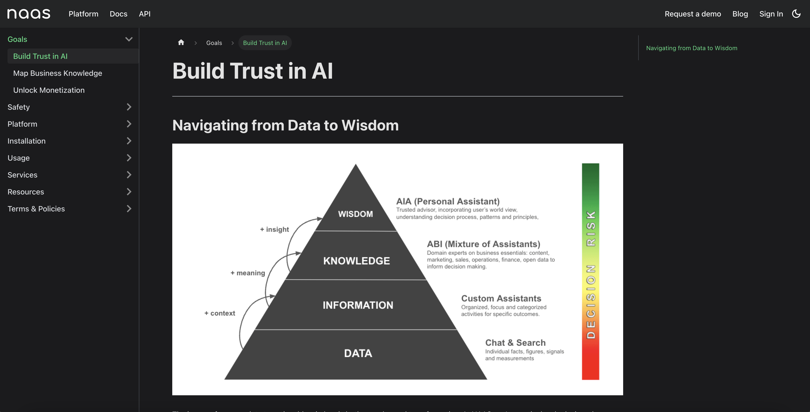

# Welcome to Naas Docs Beta

## Introduction
We're excited to unveil the early beta release of Naas.ai's documentation, a significant leap from alpha towards our ultimate goal: a universal data and AI platform. This documentation is designed to be as intuitive and detailed as the manual accompanying a sophisticated physical product, underscoring our commitment to accessibility and clarity.

While we're still rolling out features, this resource offers a transparent view into the value Naas provides and what you can expect as we progress.

## Structuring for Clarity and Value
Our documentation is structured around several core sections:

1. **Goals**:
   - **Build Trust in AI**: Discover our AI Assistants suite, featuring your personal AIA, the comprehensive ABI for your business needs, and the flexibility to introduce Custom Assistants.
   - **Map Business Knowledge**: Delve into the ABI knowledge graph, emphasizing content strategy for sales pipeline development and conversation management for operational excellence.
   - **Unlock Monetization**: Navigate our marketplace to access and offer AI-driven products and services, empowering both creators and users in the AI ecosystem.

2. **Safety**: Essential safety guidelines and information are detailed to ensure a secure experience on the platform.

3. **Platform Deep Dive**: Explore the rich frameworks integrated into Naas, along with an extensive array of features, tech components, and a transparent pricing model.

4. **Installation**: Step-by-step instructions to get started with Naas, including profile setup and workspace configuration.

5. **Usage**: Engage with different Large Language Models, develop your AIA, explore ABI Assistants SOPs, and innovate with custom Assistants.

6. **Services**: A comprehensive look into the open-source infrastructure and APIs that underpin Naas.

7. **Resources**: A wealth of community resources, help center access, and developer tools.

8. **Terms & Policies**: The legal framework and usage policies governing the Naas platform.

## Join the Journey as a Design Partner
Your feedback is instrumental in shaping the future of Naas.ai. As we improve and expand our documentation, we invite you to contribute your insights and become a Design Partner. Together, we can craft an AI and data platform that not only meets but exceeds the needs of users worldwide.

Contact us at support@naas.ai if you are interested, and let us know why in the email.

You can now into the Naas Docs Beta and discover how to harness the full potential of our platform. We're eager to support you every step of the way. Let's shape the future of data and AI together.