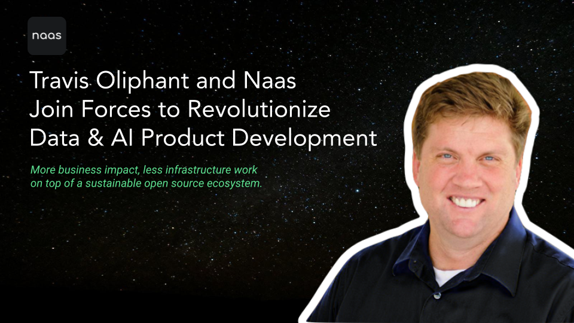

Greetings, dear readers! We're beyond thrilled to announce that the renowned [Travis Oliphant](https://www.linkedin.com/in/teoliphant/), one of the most influential figures in the Open Source community, has joined Naas as a key member of our core team and community!

With over two decades of experience in the field of data science and open-source software development, it's hard to overstate the impact that Travis has had on the world of data science.

For those of you who might not know him, Travis is the mastermind behind NumPy, the foundational Python library that powers so much of the numerical computing and data analysis we take for granted today. In fact, NumPy is the backbone for a vast array of other essential libraries like Pandas, SciPy, Matplotlib, Scikit-learn, and TensorFlow, just to name a few. And it doesn't stop there. Travis is the co-founder of Anaconda, a widely-used programming platform that simplifies the management of Python packages and environments. He is a true legend in the open-source data science community!

Travis's decision to join Naas as lead investor (), and active member of the core team andof the  Board of Directors marks an exciting new chapter in our journey, with tremendous benefits for our users.

First of all, it is a clear endorsement of our mission to empower anyone to create data and AI products more efficiently without sacrificing the power of traditional coding. Being a relatively young team, it is also a tremendous honor for us to receive the support of someone who has advocated community-driven development and open-source software for over 20 years.

Travis and his team at OpenTeams Incubator bring a wealth of knowledge and experience that will undoubtedly help us achieve our goals faster. With his guidance and advice, we are in a better than ever position to execute our mission, and we now have access to senior advice and guidance that is typically out of reach for startups like Naas. Furthermore, Travis has already played a critical role in attracting new investors eager to support Naas's mission, which speaks volumes to his commitment to Naas's long-term growth.

Naas's future is looking brighter than ever. With Travis on board, we're more confident than ever about our mission of building powerful, accessible, and open-source tools for data science. Stay tuned for more updates on how Travis will contribute to our team, and please join us in welcoming him to our community!

We also have some news of our own! We are so excited about the future of Naas that, starting this week, we will be releasing blog posts to keep you in the loop. As we continue to grow and evolve, we want to give you a behind-the-scenes look and share insights to help you make the most of our powerful open-source platform. Stay tuned for more updates on what we have in store, we are just getting started!

By the way, we'd love for you to get involved and help us out. We value all kinds of contributions - not just code. Check out our [contribution guidelines](https://docs.naas.ai/contributing-to-naas) to learn how you can get started.