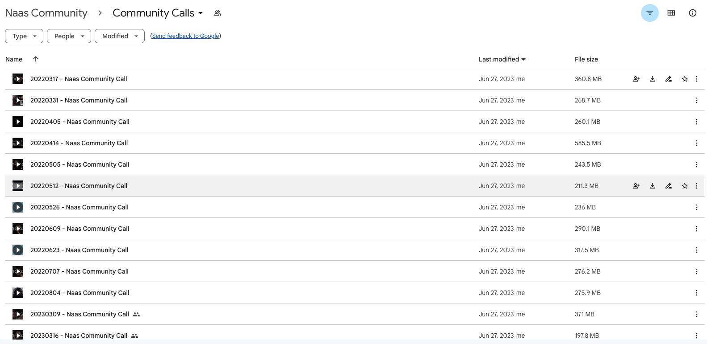

# Events

## Type of Events

There are 2 kinds of community events:

- **Public Shows**: where we discuss the vision, new releases, and do live demos.
- **Community Calls**: every 2 weeks on Thursday at 5 PM CET (following our 2 weeks iterations cycles), where we review the work done in the last iteration, and the work to be done in the next. 

## Events Calendar
We recommend adding our [Community Calendar](https://calendar.google.com/calendar/u/0/embed?src=c_aultg6lanla9l39k8f5fm7d264@group.calendar.google.com&ctz=Europe/Paris) to your personal calendar. This will ensure you never miss an upcoming event and will automatically adjust the event times to your local timezone. To do this, simply click on the blue arrow located at the bottom left of the Google Calendar. Please note that the events are displayed in the Central European Time - Paris timezone.

<iframe src="https://calendar.google.com/calendar/embed?src=c_aultg6lanla9l39k8f5fm7d264%40group.calendar.google.com&ctz=Europe%2FParis" width="100%" height="550"></iframe>

## Events Recordings

All the meeting recordings are accessible in the Naas Community shared Google drive, [request access here](https://drive.google.com/drive/folders/19PwqFvS3X04HF4KMcNxqeoIya2GDsuvj?usp=drive_link).

