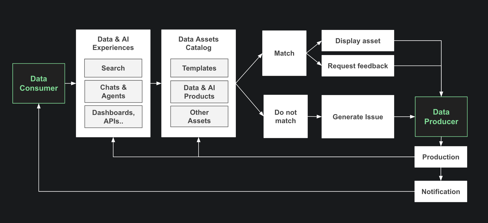

# Data Product Framework

:::tip

We're in the early alpha stage, we recommend booking a meeting with us for personalized guidance and support.

:::

The Naas Data Product Framework offers a user-friendly and streamlined workflow that allows organizations to create powerful Data & AI Products using Naas low-code layers and devops best practices leveraging GitHub repositories and workflows. 

With Naas, Data Producers such as business analysts, scientists, and engineers can harness the automation, analytics, and AI capabilities within Jupyter notebooks to unlock the full potential of their data and distribute data to Consummers in a very lean way. This page provides a comprehensive overview of the Naas Data Product Workflow, highlighting its key components and the benefits it brings.

## Introduction to Data Products
Data products are ready-to-use sets of high-quality data that provide valuable insights for making data-driven decisions. They can include comprehensive views of customers, employees, channels, or virtual replicas of real-world assets or processes. By treating data as a product, organizations can derive impressive returns and reduce implementation time and costs.

## Data Consumers and Producers

Data Consumers play a vital role in the data product ecosystem. They are individuals who navigate across search, chat, and dashboards to manage their business operations, gain insights, and make data-driven decisions. These consumers rely on data products to provide them with timely and relevant information that is crucial for their day-to-day activities. They interact with data products through various interfaces, exploring visualizations, querying databases, and accessing reports to extract valuable insights.

The feedback and actions of data consumers are invaluable to the iterative development process of data products. Whether they view content, request additional features, or report issues, their input guides Producers in refining and creating data and AI experiences. Producers, including data engineers, data scientists, and product managers, leverage this feedback to improve the functionality, usability, and value of data products.

This collaborative relationship between data consumers and producers is essential for delivering valuable and impactful data products. By understanding the needs and challenges faced by data consumers, producers can design and develop data products that effectively address their requirements. Regular communication, user testing, and continuous iteration are key to ensuring that data products align with the evolving needs of consumers, empowering them to derive maximum value from the available data.

By fostering this symbiotic relationship between consumers and producers, organizations can create data products that truly meet user expectations, enhance decision-making capabilities, and drive business success.

## The Naas Data Product Workflow
The Naas Data Product Workflow combines three essential components: Jobs, Drivers, and Templates. These components work together seamlessly to facilitate efficient data product development.

- **Jobs** serve as the core processing units within the Naas Data Product Workflow. They execute specific tasks such as data extraction, transformation, analysis, and visualization. Jobs form the backbone of data product pipelines, orchestrating the flow of data and generating valuable insights.

- **Drivers** act as connectors in the Naas Data Product Workflow, enabling seamless integration with various data sources and services. They simplify data integration tasks, allowing users to access and utilize data from databases, APIs, machine learning algorithms, and more.

- **Templates** are reusable building blocks within the Naas Data Product Workflow. They provide pre-configured frameworks for common data processing tasks, accelerating development. Templates can be customized to meet specific requirements, ensuring flexibility and adaptability when creating data products.

By integrating these components into a unified workflow, the Naas Data Product Framework empowers organizations to rapidly develop data products with reduced complexity.

## Benefits of Building Data Products in Naas

Implementing data products in Naas offers several benefits:

1. **Efficient Implementation**: By treating data as a product, organizations can reduce the time it takes to implement data in new use cases by up to 90%. Naas provides a modular framework that allows for the quick deployment of data products across different business applications.

2. **Cost Reduction**: Organizations can decrease the total ownership costs, including technology, development, and maintenance, associated with data products by up to 30%. Naas facilitates reuse of existing processes and components, enabling efficient production and minimizing redundant work.

3. **Risk Reduction and Data Governance**: The data product approach in Naas ensures data quality, standardization, and adherence to data governance principles. By following best practices and utilizing predefined patterns, organizations can reduce risk and maintain data integrity.

## Managing and Developing Data Products in Naas

To effectively manage and develop data products, Naas recommends the following:

1. **Product Management**: Assign dedicated product managers responsible for assembling teams of experts to build, support, and improve data products over time. These product managers, along with the supporting team of data engineers, data architects, and data platform engineers, work within a data utility group. This group should be embedded within a business unit to ensure close collaboration with subject-matter experts and operational teams.

2. **Center of Excellence**: Establish a center of excellence that supports data product teams and sets standards and best practices for building data products across the organization. This central hub defines data provenance, data quality measurement, and data access controls. It also facilitates the reuse of data products and ensures compliance with regulatory requirements.

3. **Evaluation and Quality Assurance**: Regularly track the performance and quality of data products using metrics such as active monthly users, user satisfaction, and return on investment for use cases. Ensure data definitions and availability are managed effectively, and work closely with data stewards to maintain data integrity.

## Getting Started with Data Products in Naas

To get started with data products in Naas, organizations should:

1. **Opportunity Discovery**: Evaluate the feasibility and potential value of use cases in each business domain, grouping them based on the data products they require and the consumption archetypes involved. Categorizing use cases helps prioritize work and optimize return on investment.

2. **Product Development**: Assign product managers and assemble expert teams to develop and support data products. Leverage Naas's modular framework and predefined consumption archetype patterns for efficient development.

3. **Talent Acquisition**: Build a strong team of data engineers and experts to support data product development. Consider a phased approach, combining hiring contractors with targeted recruitment efforts, skill development programs, and internal knowledge-sharing initiatives.

4. **Measurement and Iteration**: Continuously track the performance of data products and iterate based on user feedback and evolving business needs. Use metrics to assess the impact of data products and ensure they align with organizational objectives.

Implementing data products in Naas can provide organizations with a significant market edge by increasing speed, flexibility, and unlocking new opportunities for utilizing data.

## Data Product Template Repository

### How Does It Work?

This repository is a boilerplate for anyone who wishes to develop a data product using Naas. It is structured as follows:

- The `/assets` folder stores any PNG, JPG, GIF, CSV, diagrams, or slides related to the documentation of the product.
- The `/inputs` folder stores the parameters and any other files needed (data, referential) to run the files in the `/models` folder.
    - **Referentials**: This subfolder should contain any reference data that is needed to run the models in the `/models` folder. This may include data dictionaries, lookup tables, or other types of reference data.
    - **Mappings**: This subfolder should contain any mapping files that are needed to run the models in the `/models` folder. These may include files that define how data fields should be transformed or combined.
    - **Rules**: This subfolder should contain any rule files that are needed to run the models in the `/models` folder. These may include files that define how data should be filtered, aggregated, or otherwise processed.
- The `/models` folder stores any files that transform inputs into outputs (notebook, Python, SQL files). It should be organized with the following structure:
    - **Bronze**: This category should contain models that have been trained on a limited dataset and have achieved relatively low accuracy. These models may be useful for initial testing and prototyping but may not be suitable for use in production environments.
    - **Silver**: This category should contain models that have been trained on a larger dataset and have achieved moderate accuracy. These models may be suitable for use in certain production environments but may not be the most accurate option available.
    - **Gold**: This category should contain the most accurate models that have been trained on the largest and most diverse dataset available. These models are suitable for use in the most demanding production environments and are the top choice for mission-critical tasks.
    - **Insights**: This category should contain any additional information or analysis related to the models in the Bronze, Silver, and Gold categories. This may include performance metrics, error analysis, and other useful insights.
- The `__pipeline__.ipynb` file is a special file that specifies the order in which the models in the Bronze, Silver, and Gold categories should be trained and evaluated. This file is used to automate the model selection process, ensuring that the most accurate model is always used for a given task.
- The `IMO_template.ipynb` file contains a collection of templates for data preprocessing, model training, and evaluation. These templates can be used as a starting point for creating new models and can be customized as needed to suit the specific requirements of your project.
- The `/outputs` folder stores all the files that would be exposed outside of the Naas server.
- The `/tests` folder stores all tests to be performed before production.
- The `/utils` folder stores all common functions used across files.
- The `requirements.txt` file lists all the packages and dependencies.
- The `settings.ipynb` file runs the product on a Naas server.
- The `update.ipynb` file pulls this repository again.

### What Are The Benefits?

Some benefits of the Naas Data Product Framework are:

- **Low-code approach**: The low-code nature of the Naas platform makes it easy for anyone, regardless of their technical background, to create powerful data products.
- **Open source**: The open-source distribution model of Naas ensures visible source code and versioning, and allows you to create custom logic.
- **Jupyter integration**: Naas integrates seamlessly with Jupyter notebooks, allowing you to create data products from the comfort of your familiar environment.
- **Versatility**: With its templates,

 drivers, and features, Naas is highly versatile and enables you to build almost anything.
- **Cloud-based**: Naas Cloud, the stable environment provided by Naas, allows you to access the platform from anywhere with an internet connection.

Overall, the Naas Data Product Framework is a powerful tool for anyone looking to create data products that combine automation, analytics, and AI.

### Why a Data Product Development Framework Like Naas is Necessary?

Just as web development frameworks like React.js help developers create web applications more efficiently by providing a set of standardized tools and components, data product development frameworks like Naas help data scientists and engineers create data products more efficiently by providing a set of standardized tools and components specifically designed for data processing, analytics, and AI.

Some specific benefits of using a data product development framework like Naas include:

- **Standardized structure**: A data product development framework provides a standardized structure for organizing and developing data products, which can make it easier to develop, maintain, and scale data products.
- **Pre-built components**: A data product development framework includes a set of pre-built components, such as data connectors and data transformation tools, which can save time and effort compared to building these components from scratch.
- **Integration with other tools**: A data product development framework typically integrates with other tools and technologies commonly used in the data world, such as Jupyter notebooks and machine learning libraries, which can make it easier to build and deploy data products.
- **Collaboration and sharing**: A data product development framework can make it easier for multiple people to collaborate and share data products within an organization, as it provides a consistent framework for development and documentation.

Overall, a data product development framework like Naas can provide several benefits to data scientists and engineers, including improved efficiency, integration with other tools, and the ability to collaborate and share data products within an organization.

### How Data Products And Associated Contracts Can Create More Trust From End-Users?

A data product framework can help with defining data contracts and creating trust with end-users in several ways:

- **Standardized structure**: A data product framework provides a standardized structure for organizing and developing data products, which can make it easier to define clear and consistent data contracts. For example, if a data product is built using a framework that specifies how input and output data should be structured and documented, it can be easier for end-users to understand how the data product works and what they can expect from it.
- **Transparency**: Many data product frameworks are open source, which means that the source code is visible and can be reviewed by anyone. This transparency can help build trust with end-users, as they can see exactly how the data product works and how it processes their data.
- **Auditability**: A data product framework can also provide tools and processes for auditing and reviewing data products, which can help ensure that they are reliable and accurate. This can be especially important for data products that are used in mission-critical applications, as end-users need to be confident that the data products are reliable and trustworthy.

Overall, a data product framework can help create trust with end-users by providing a standardized and transparent structure for developing data products and by providing tools and processes for auditing and reviewing the products to ensure their reliability.

## Conclusion

Data products play a crucial role in maximizing the value of data within organizations. By adopting the data product framework in Naas, organizations can efficiently develop, manage, and leverage data products to drive business growth, improve decision-making, and gain a competitive advantage in the market.

Note: The content above is based on insights from the Harvard Business Review article "A Better Way to Put Your Data to Work" by Veeral Desai, Tim Fountaine, and Kayvaun Rowshankish (July–August 2022).