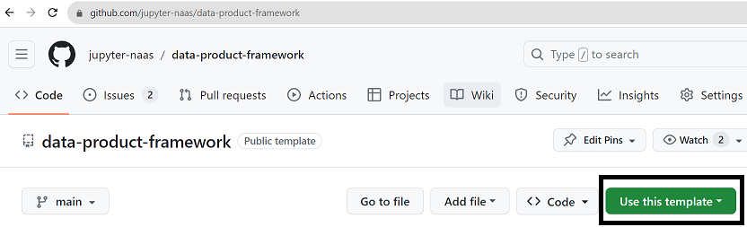
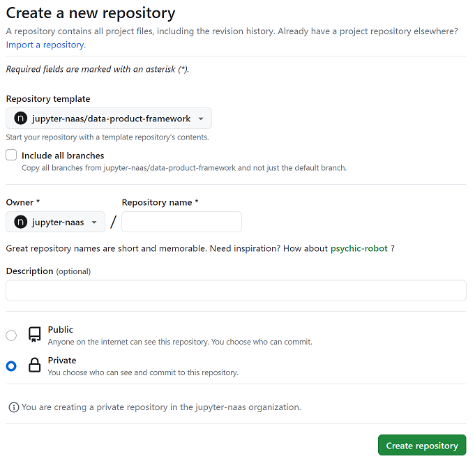

# Data Product Framework

:::tip

We're in the early alpha stage, we recommend booking a meeting with us for personalized guidance and support.

:::

The Data Product Framework is a comprehensive guide to developing your own data products using Naas.

In this section, you will discover comprehensive information related to the topic. This includes its importance, guidelines on how to construct it, the resources we provide for your assistance, and how to effectively manage the launch of your product.

## Why you should build Data Products?

A single template in Naas empowers you to serve your business and deliver value promptly. With minimal configuration, you can ascertain the effectiveness of these templates and set up automation.

Once you're comfortable with one, you have the option to either enhance it by adding new features and outputs, or use a new template to carry out a different task.

Eventually, you might find yourself overwhelmed with maintaining duplicating code, excessively calling external APIs, reaching their limits, and not fully leveraging the data you're acquiring. This is the point where bundling templates together to start your data product becomes beneficial.

### Maximizing Efficiency and Value with Templates Consolidation

By consolidating multiple Jupyter notebooks into a single data product, you can effectively streamline your workflows and fully harness your data's potential. This process aids in establishing a pipeline that connects all the notebooks, enabling them to function as integral components of a more extensive workflow.

This strategy not only enhances efficiency but also fosters collaboration, paving the way for a diverse array of insights and perspectives.

### Adopting a Data Lake Approach

This comprehensive strategy enables you to create a data lake, a centralized repository designed for storing and reusing your data across a multitude of use cases. A data lake approach not only facilitates efficient data management but also ensures that your data is readily accessible and reusable.

By adopting a data lake approach, you can ensure that your data is organized, secure, and ready to provide valuable insights when needed. This approach is particularly beneficial when dealing with large volumes of data, as it allows for efficient storage and retrieval, making it easier to derive value from your data.

### Minimize Computing Costs

If you begin by using templates, there's a chance you might find yourself repeating certain code elements, such as external API calls. Over time, this could impact your credit consumption. Therefore, creating a data product and having the ability to divide notebooks into parts to avoid repeated data access calls can greatly reduce computing time.

### Guarantee Robust Data Governance & Security

Creating a data product implies the utilization of the industry's best practices, which in this context involves using GitHub.

With GitHub, you can enhance code security, storage, and version control. Moreover, it facilitates improved data governance by granting access to your data team and tracking this data product within a roadmap.

By leveraging GitHub and adhering to the industry's best practices, you ensure that your team upholds high standards of data governance for your data product.

### Create Company Intangible Assets

Building data products extends beyond immediate advantages. Each data product you develop transforms into an intangible asset for your company, fostering long-term growth and success. When you convert raw data into actionable insights, you're not merely managing data; you're creating value.

Furthermore, all costs associated with it can be considered as capital expenditure (Capex), as it generates real value for your company.

## Kickstarting Your Own Data Product: A Step-by-Step Guide

This comprehensive guide is designed for data producers aiming to elevate their work to the next level. It facilitates a swift initiation into data product development, enhancing not just coding skills but also communication and management aspects related to the data product.

### Clone the Data Product Framework

Start by utilizing the data product framework provided by Naas on GitHub.

You can directly clone the `data-product-framework` repository into your Naas Lab instance. This ready-to-use GitHub template serves as a robust foundation for your data product.

Ensure you have a GitHub account before initiating this procedure.

Below are the steps to follow:

1. Go to GitHub: https://github.com/jupyter-naas/data-product-framework
2. Click on 'Use this template' to create a new repository.

3. Set it up within your organization.

### Set Up Your README File

A well-structured README file is crucial for comprehending the project. Think of it as a user manual that offers a clear overview of your data product, its objectives, and its usage.

Here are some key components to update in your README:

- **Project Title**: Choose a title that accurately mirrors the purpose and functionality of your data product. For instance, if your data product is designed to analyze social media trends, an apt title might be "Social Media Trend Analyzer".
- **Description**: This section should offer a thorough overview of your project. It should explain what the data product does, the problem it addresses, and how it achieves this. For example: "The 'Social Media Trend Analyzer' is a data product designed to monitor and analyze trends across various social media platforms. It gathers data on specific keywords and hashtags and employs advanced analytics to detect patterns and trends. This tool can be utilized by businesses to oversee brand mentions, track the performance of marketing campaigns, and gain insights into customer preferences and behavior. Its user-friendly interface and detailed visual reports make it accessible for even non-technical users to comprehend and leverage the insights it provides."
- **Contact Information**: Provide your contact details so others can reach out if they have queries or require further clarification. For instance: "For any inquiries or additional information, please contact John Doe at [johndoe@example.com](mailto:johndoe@example.com)."

The primary aim of the README is to deliver clear, concise, and useful information about your project. It's often the first thing people see when they encounter your project, so it should be both engaging and informative.

As the data product development progresses, you can update sections like installation instructions, usage, and others such as contributing or licensing if your project is open source.

[IMAGE - README]

### Design Your Workflow

Visualizing your workflow from start to finish is crucial to the success of your project. Having a clear picture of your end goal will help you prioritize what's essential to build. 

We recommend starting with a simple, straightforward pipeline for the initial version, using placeholder steps (DummySteps in pipeline, refers to doc). 

This approach allows you to grasp the complexity of each part and subsequently break it down into different notebooks. These notebooks will then serve as the building blocks of your pipeline.

[IMAGE - Pipeline simple]

[IMAGE - Pipeline plus détaillé]

By iterating over each version, you can refine and optimize your workflow, ensuring a robust and efficient data product.

### Use Existing Templates

Naas provides a comprehensive library of templates that cater to a wide range of requirements. 

You can use the Naas Search (refer to page) to find templates that may already exist and align well with your project requirements. 

[IMAGE SEARCH]

If you're using Naas Lab, click on 'open in Naas Lab', and the notebook will be directly downloaded to the root folder of your machine. Alternatively, you can use the GitHub link for access and download.

[IMAGE  OPEN_IN_NAAS_LAB]

If you're using Naas Lab as your development environment, you can also access these templates in the '__templates__' folder located in the root directory of your machine. (Please remember not to edit within this folder, as it's a read-only folder updated every hour with new templates.)

After obtaining your templates, you can add them to your `/models`folder to begin constructing your pipeline.

Choosing these templates means you won't have to start from scratch, and you'll also be able to leverage some Naas drivers that abstract complex code used in notebooks.

Remember, while these templates are designed to give you a head start, they can always be customized to better align with your specific needs.

### Setting Up and Scheduling Your First Notebook Pipeline

Now that you have a workflow and some templates, you can begin working on your first notebook.

Start with the notebook that will create the output directly generating value for the end users. Then, work backward through your pipeline to build the other components in your notebook.

Once your first notebook is complete, replace the DummySteps with real NotebookStep and execute it to ensure your pipeline is functioning correctly. (You can keep your DummySteps)

If anything goes wrong, make the necessary adjustments inside your notebook. You will find the notebook executed in the pipeline_executions folder (refers to pipeline doc).

Otherwise, you can proceed to the setup notebook and push your pipeline to production. Don't forget to add the notebook path present in the notebook steps as a dependency.

Monitor your execution in your Naas manager (link to page).

## Understanding the Data-Product-Framework

This repository is a boilerplate for anyone who wishes to develop a data product using Naas. It is structured as follows:

- The `/assets` folder stores any PNG, JPG, GIF, CSV, diagrams, or slides related to the documentation of the product.
- The `/inputs` folder stores the parameters and any other files needed (data, referential) to run the files in your data product.
- The `/models` folder stores any files that transform inputs into outputs (notebook, Python, SQL files).
- The `/outputs` folder stores all the files that would be exposed outside of the Naas server.
- The `/tests` folder stores all tests to be performed before production.
- The `/utils` folder stores all common functions used across files.
- The `requirements.txt` file lists all the packages and dependencies.
- The `setup.ipynb` file runs the product on a Naas server.

### Using the Inputs Folder (/inputs)

This folder serves as a repository for parameters and other essential files (such as data, reference materials, mappings, and images) required for your data product.

You can store images to be displayed in your README or static reference materials to be utilized by your models. This organized storage system aids in maintaining a clean and efficient workflow for your data product.

### Organizing Models (/models)

The 'models' folder is where the building blocks of your pipeline reside. This is where you'll use templates or create notebooks that form the backbone of your data product.

To start, we recommend placing all your notebooks within this folder. As your data product grows and becomes more complex, you may find it beneficial to further organize your notebooks by tools or functionalities. 

This approach can help manage different pipelines more effectively, ensuring a well-structured and scalable data product."

### Managing Data Storage in 'Outputs' (/outputs)

The 'outputs' folder is specifically designed to store output files. For users without a dedicated data lake, Naas Lab offers a convenient temporary solution where you can start saving your outputs.

Files stored in the 'outputs' folder are kept on the user's file system, providing a secure environment that ensures data privacy.

For optimal organization and future scalability, it's recommended to structure the 'outputs' folder to resemble the architecture of a data lake. This approach facilitates a smoother transition when you decide to move to a dedicated data lake.

To ensure data security and traceability, it's advisable to store file versions with timestamps. Additionally, always keep a copy of the latest version readily accessible for easy reference and use

### Leverage the Utils Folder (/utils) and naas_data_product library

The 'utils' folder allows for code factorization, improving readability and reusability of common functions across notebooks. 

Users can import the 'naas_data_product' package into their notebook to access and use the functions and variables loaded from any notebooks stored in 'utils'.

This capability is extremely useful for quickly building a data product. We recommend packaging the code into a Python library if you anticipate reusing it in another data product.

For guidance on how to create a library, please visit the following page.

### Utilizing the Tests Folder (/tests)

The 'tests' folder is where you should create and store your own tests to ensure your scripts run as expected. 

By conducting regular tests, you can identify and fix any issues or bugs early in the development process, ensuring the reliability and accuracy of your data product.

### Using the Requirements File (requirements.txt)

The 'requirements.txt' file is a crucial component of your data product. It lists all the packages and their specific versions that need to be installed for your scripts to run correctly. 

This file will be used on the serverless instance to ensure the correct environment is set up for your data product. By clearly specifying the required packages, you can prevent potential compatibility issues and ensure the smooth operation of your scripts.

### Setting Up Your Data Product and Pushing to Production (setup.ipynb)

The 'setup.ipynb' file plays a crucial role in deploying your data product to production. It's designed to install the necessary requirements, set up dependencies, and schedule tasks. Whenever you need to push an update to production, simply run this setup file.

After execution, the results will be displayed in the Naas Manager, providing you with an overview of the setup status. This ensures that your data product is always running with the latest updates and in the optimal environment."

## Monitoring Your Execution

### Track Execution with Your Naas Manager

The Naas Manager, accessible from your Naas development Lab, enables you to monitor all your jobs and events. It also includes a notification system.

By default, all jobs come with a notification system that alerts you via email (linked to your Naas account) if they fail. However, you can customize these notifications by adding more emails, setting alerts for when tasks are completed, or even setting up alerts for when tasks are initiated. Please refer to the documentation for detailed instructions. Below is an example of how to set it up for the scheduler.

### Handling Errors Within Your Pipeline

Within your pipeline, you can establish 'on _error' steps to manage errors. If any error occurs during the execution of the notebook, the 'on error' notebook will be executed subsequently. This function can serve as a logic gate for your pipeline. We recommend sending a notification through the channel most frequently used in your company to ensure prompt bug fixing (Slack, WhatsApp, email, etc.). This will allow you to create custom error messages and pinpoint exactly which notebook failed and why.

### Establishing Your Own Error Management System within Your Notebook

Naturally, you can incorporate logic within your notebook to manage errors. This method offers more precision as you will know the exact cell that failed. However, it requires maintaining additional code and logic, which may slightly slow down your execution but will make your entire code more secure. We recommend implementing this once your data product is already in production and you have used the other method to ensure robust security and monitoring for the business team.

## Implementing a Continuous Feedback Loop

### Leveraging GitHub Capabilities

GitHub provides a robust platform for collaboration and version control. Its features, such as issues, pull requests (PRs), and project boards, promote efficient team collaboration.

Additionally, you can set up an SSH key in your Naas development environment to optimize your workflow with GitHub.

### Using Issues as Your Ticketing System

As your team will work on GitHub, we recommend using it as your ticketing system. Whenever you encounter a bug or think of an enhancement, create an issue on GitHub. This practice keeps track of everything and ensures nothing is overlooked. You can assign a team member to work on it and add tags to identify different types of issues.

### Resolving Issues with PRs

A PR can be used to resolve one or several issues. PRs allow your team to review, discuss, and make further changes if necessary before merging the code into the main branch. You can assign a reviewer for the PR who is not the same person who developed the code, ensuring quality.

### Working on Branches

Once the issue is created, GitHub offers a simple way to create a branch directly from its interface. By doing this, you avoid conflicts and ensure smooth collaboration within your team by working on separate branches. This way, the main work remains unaffected.

### Establishing Project Management

GitHub projects provide a flexible way to organize and manage work. You can create iterations, set estimates, and track progress effectively. By using GitHub projects, you can streamline your team's workflow and ensure efficient project management. We recommend only adding issues to your project board as we want to focus on the velocity of how many bugs or enhancements we addressed, not the way we did it with PRs, as a PR can close multiple issues.

## How to Deploy Your Data Product on a Serverless Instance? (Coming Soon)

Deploying your data product on a serverless instance can provide numerous benefits, including scalability, cost-effectiveness, and the elimination of server management (work on local).

In the upcoming guide, we'll break down the steps for you, making it easier to understand and implement.