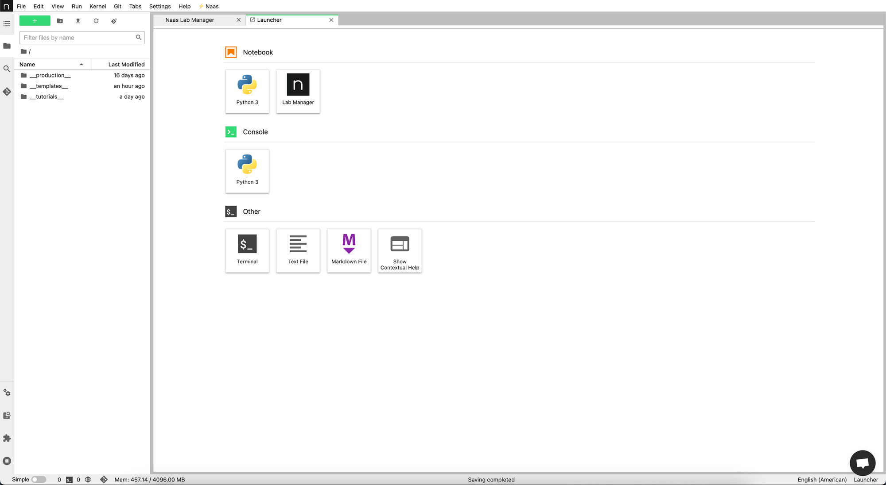
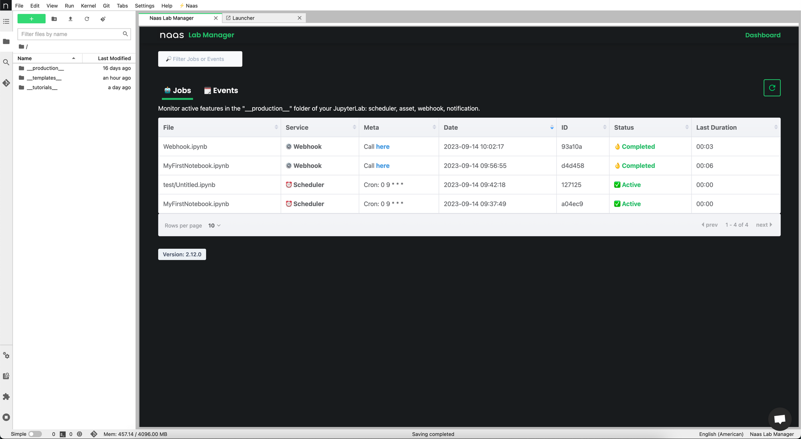
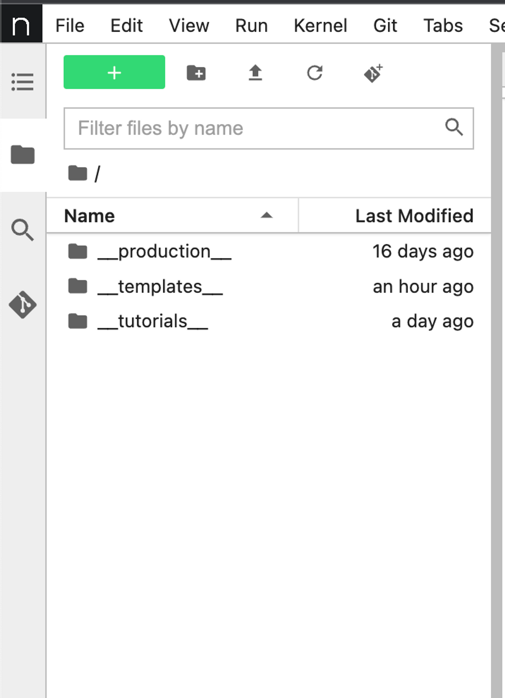
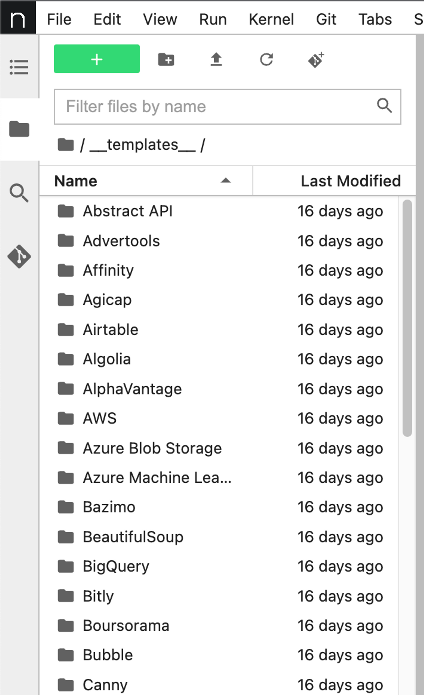
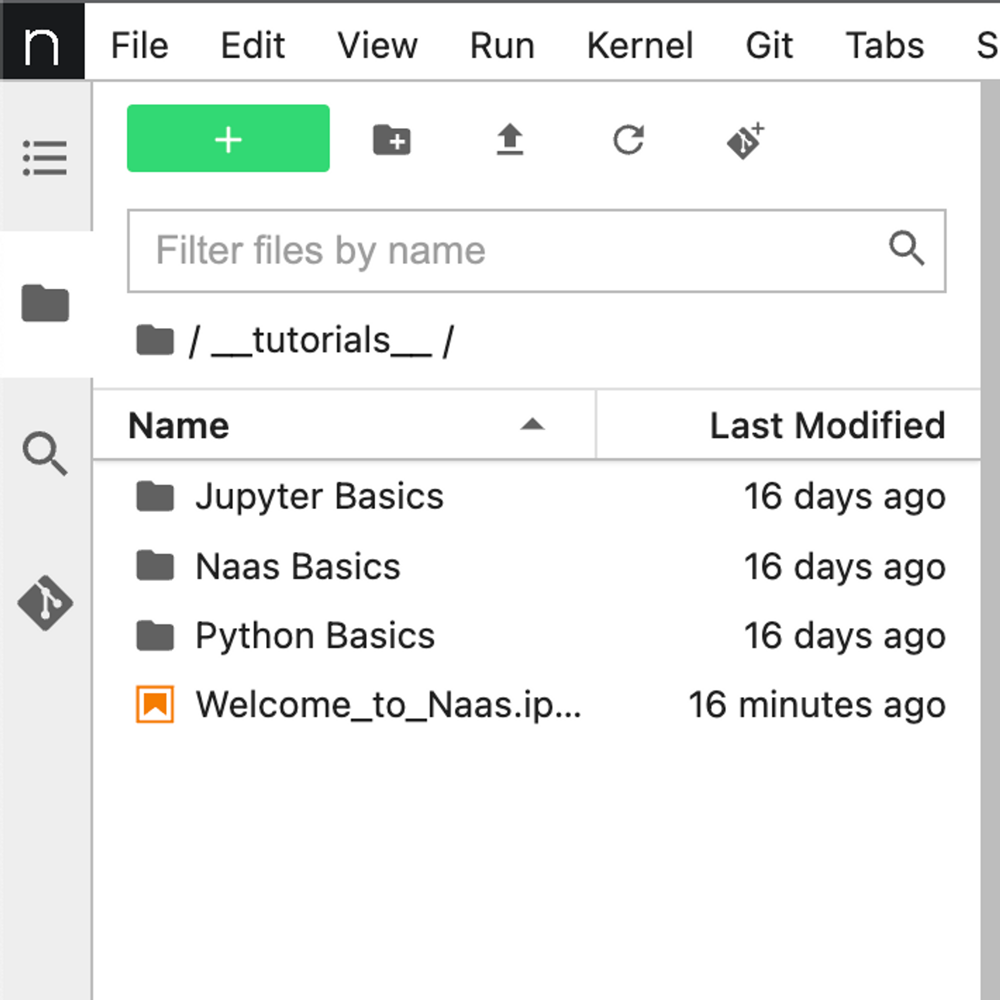

# Development Environment

In this document, we'll discuss the development environment you get when you subscribe and use Naas ([app.naas.ai](http://app.naas.ai/)).

## Jupyter Lab Instance

When you access Naas, you will have access to your own Jupyter lab instance. This is a normal Jupyter lab instance with additional services integrated into it.

## Lab Manager

In your Jupyter lab, you will see a lab manager button in the launcher. Clicking this button opens the lab manager, a web application that allows you to see the different jobs on your machine. Jobs can be schedulers, webhooks, dependencies or assets.

You can also see events, which logs every time a job is triggered. You will see when a job starts, completes, or encounters an error.

## File System

On the left of your Jupyter Lab, you will find a file system. Here, you can create notebooks, directories, and access your production directory.

## Production Directory

The `__production__` directory is the place where all your notebooks sent to production are stored.

### Adding Files to the Production Directory

Every time you call the functions `naas.scheduler.add`, `naas.assets.add`, `naas.webhooks.add`, and `naas.dependency.add`, the files you are adding will be stored in the production directory. This will reflect the place where the file is in the main file system.

For instance, if you have a notebook in a directory at the root of your file system and you schedule that notebook, you will see in the production directory that the notebook is stored in a subdirectory with the same name as the one in the main file system.

### Notebook Versioning

An important thing to note about the production directory is that every time a scheduled notebook runs, a new version of that notebook is created. The notebook's name will start with a date, indicating when it was created and executed. If you open it, it will contain all of the outputs of each cell that ran for this specific notebook execution.

### Working in the Production Directory

The production directory is not a place to work in. It is designed for you to see what happens and understand if there is an error in production. Even if there are no errors, it allows you to ensure your notebook is behaving correctly.

It's crucial not to work, delete files, or make changes in this directory. It's designed for reviewing and understanding what's happening under the hood.

## Templates Directory

The `__templates__` directory contains awesome notebooks, which you can also find on [GitHub](https://github.com/jupyter-naas/awesome-notebooks). A process clones this project every few minutes to ensure you always have an up-to-date version. We recommend copying and pasting things you want to use rather than working directly inside it.

## Tutorials Directory

There is also a tutorials directory where you can get basic knowledge about Python.

## Python 3 Notebooks

When you create a notebook, the only notebook type you can create will be Python 3. We chose to only provide Python kernels for several reasons:

- Python is widely used in the data science field.
- Python is easy to learn and use.
- For the Awesome Notebook repository, we wanted to have one language to make it easier for everyone to contribute and understand.

## Git Integration

Jupyter Lab interacts well with Git. You can have your Git repository hosted on GitHub, GitLab, Bitbucket, etc., and interact with them within Jupyter Lab. You can clone repositories, view branches, add new files, and commit and push changes.

## Configuring JupyterLab with GitHub using SSH

This section explains how to configure your JupyterLab instance on Naas to authenticate with GitHub using SSH.

### Why Use SSH?

Using SSH allows your JupyterLab instance to interact with your GitHub account without the need to enter your username or password.

### Creating SSH Key

Click on the provided link to open your JupyterLab on Naas. This will download some notebooks to facilitate the creation of the required SSH key and store it in GitHub.

Execute the cells in the notebook. One cell will contain the command `ssh-keygen -b 2048 -t rsa -f /home/jovyan/.ssh/id_rsa -q -N ""`. This command creates an SSH key on your machine.

### Displaying Public Key

The `cat` command will display the content of the public key in the output section of the notebook. Two keys are generated, but you only need the public key for GitHub.

### Adding SSH Key to GitHub

Go to your GitHub account and navigate to `https://github.com/settings/ssh/new`.

On this page, you can add a new SSH key. Paste the public key into the key section and click on 'Add SSH Key'. You don't need to provide the title or key type. If you have MFA activated on GitHub, you may need to enter an authentication code.

### Cloning a Project from GitHub

When cloning a project from GitHub, it's important to note that there are two ways to clone a project: through HTTPS or SSH. The configuration we just performed is for SSH.

So, when you go to a project and click on the green 'Code' button to copy the clone command, make sure to use the SSH version of it.

# Future Updates: Working in Any IDE

Currently, Naas features like the lab manager, scheduler, assets, dependencies, and webhooks are embedded inside the Jupyter lab and can only be accessed via [app.naas.ai](http://app.naas.ai/).

However, we are working on converting these features into API services. Once this is done, you will be able to install the Naas Python library locally on your machine or in any other environment. This will allow you to send a notebook to production using `naas.scheduler.add` from a remote location.

When these changes are implemented, you will be able to use your local IDE, such as VS Code, and won't have to work directly from [app.naas.ai](http://app.naas.ai/). In this scenario, [app.naas.ai](http://app.naas.ai/) will become a development environment for users who do not already have a local development environment configured to their liking.