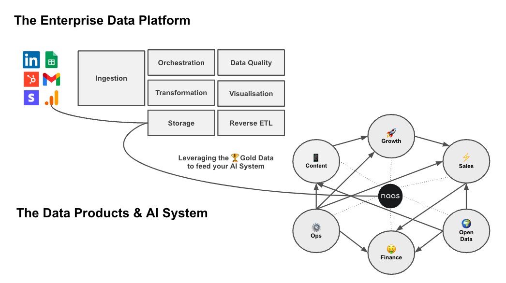
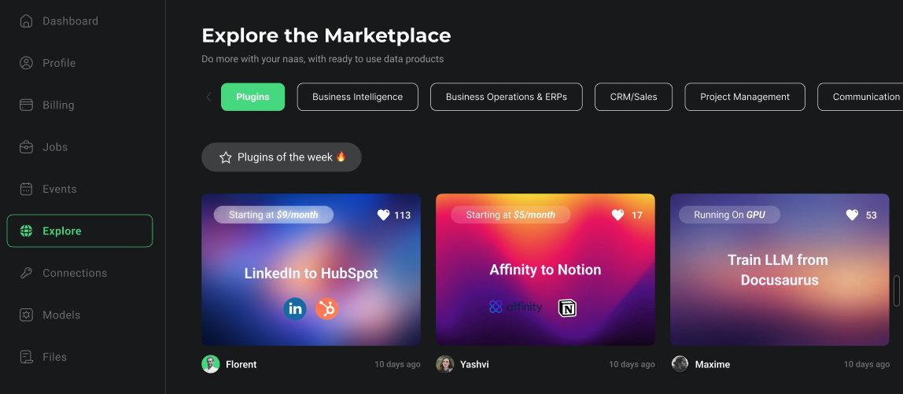

# Advanced level
---

If you have already gained experience with Naas Chat and generative AI models, the advanced level is designed to help you harness the full-fledged capabilities of Naas and take your data operations to the next level. The advanced usage of Naas encompasses both the business and technical aspects, enabling you to work as a team and connect data consumers to data producers more efficiently.

:::tip 
Available with Enterprise Plan - Book a call with us to learn more.
:::tip

## Business Side: Connecting Data Consumers and Producers

In the advanced usage level, Naas enables you to connect data consumers with data producers more efficiently. 

### Creating a powerful feedback loop

Data consumers can access the catalog of templates available to them through  Search and Language Models via Chat. These templates can go beyond simple prompts and include automation features, data snippets, and more. Data producers, who create the catalog, make these templates available to the data consumers in the Search.

Once data consumers access the catalog, they can tap into assets generated by the templates. These assets are displayed within the chat interface. If the asset matches the request, a feedback loop can provide positive feedback. If it doesn't match, another feedback loop can generate an issue in the repository of the data product, which is versioned through Git. This Git-based workflow facilitates communication and feedback between data producers and consumers.

### Building Enterprise-grade AI systems

Creating your own AI system involves interconnecting various data engines to leverage their combined capabilities. This process is about integrating different data sources and workflows to build a system that can process, analyze, and learn from the data to generate valuable insights and make intelligent decisions.

Here's a brief overview of how the interconnection of data engines can help in creating your own AI system:

1. **Content Creation Engine**: This engine is responsible for analyzing and generating content. It can be trained on existing content to understand the style, tone, and context, and then produce new content that aligns with these parameters.
2. **Growth Marketing Engine**: This engine uses data to identify new and qualified contacts for your business. It analyzes user behavior, engagement metrics, and other relevant data to optimize marketing strategies and drive business growth.
3. **Sales Conversion Engine**: The goal of this engine is to transform interest into revenue. It uses data to understand customer behavior, preferences, and needs, and then tailors sales strategies to effectively convert leads into customers.
4. **Operation Efficiency Engine**: This engine focuses on optimizing business operations through data analysis. It can identify bottlenecks, inefficiencies, and areas for improvement in your operational processes.
5. **Finance Management Engine**: This engine uses data to provide insights into financial performance, budgeting, and forecasting. It can help in making informed financial decisions and ensuring financial health of the business.
6. **Open Data Intelligence Engine**: This engine leverages publicly available data to extract insights that can be valuable for the business. It can help in understanding market trends, competitive landscape, and other external factors that can impact the business.

By interconnecting these engines, you can create a holistic AI system that not only understands and learns from your data but also generates actionable insights that can drive business growth. This system can continuously learn and adapt to new data, making it more accurate and efficient over time.

Moreover, this interconnected system can be further enhanced by the use of vector databases and fine-tuning of your own AI models. This can help in retrieving specific context-based data and training your AI system to provide insights that are more accurate and relevant to your business.

In summary, the interconnection of data engines allows for the creation of a comprehensive, efficient, and intelligent AI system that can drive significant value for your business.

## Technical Side: Leveraging Data Products

The advanced usage of Naas involves creating data products by combining templates. Naas provides a suite of data products for solutions such as content marketing, sales, operations, finance, and more. These data products are a combination of templates that work together to provide comprehensive solutions. By leveraging data products, you can streamline your data operations and achieve more efficient and powerful results.

### Git Flow and Versioning

To ensure proper version control and management of data products, Naas leverages Git. By packaging data products into GitHub repositories, you can track changes, manage versions, and facilitate collaboration between data producers and consumers.

### Scaling with APIs and Storage Systems

To scale your advanced usage of Naas, you can create APIs that enable you to query data products. This requires setting up a storage system, such as an S3 or Google bucket, to store your data files. By deploying the necessary APIs, you can retrieve data from the storage system and render the output. This capability allows for more dynamic plugins and real-time data processing.

### Vector Databases Integration 

In the near future, we will be integrating vector databases into our platform. This enhancement will enable you to perform intricate queries and operations on your data, helping you extract more meaningful insights and make data-driven decisions.

### Fine-Tune Your Own Model

We are also developing a feature that will allow you to fine-tune your own models within the Naas space. This means you will have the ability to customize and optimize your models to better suit your specific needs, thereby improving the accuracy and relevance of your data experiences.

### Monetization and Naas Marketplace (coming soon)

As you deploy data products, you can also explore monetization opportunities. The Naas Marketplace will provide a platform for you to share and sell your data products. By shipping APIs that others can use, each API call becomes a potential revenue generator. This allows you to not only benefit from your internal workflows but also monetize them outside of your organization.

## Conclusion

The advanced usage of Naas encompasses both the business and technical aspects of the platform. By understanding and utilizing these features, you can efficiently connect data consumers and producers, leverage data products, run advanced code in Naas Lab, generate plugins, scale with APIs and storage systems, explore monetization opportunities, and ensure proper version control with Git. 