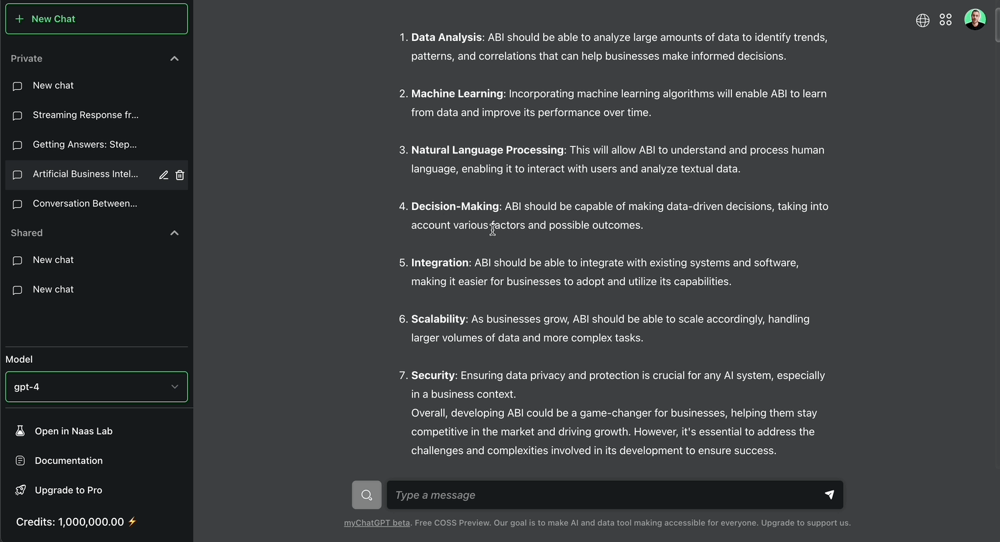

# Introduction

Welcome to Naas Documentation, the all-in-one data platform designed to become the universal solution for all your data needs. This platform provides a low-code solution for creating powerful data products by combining automation, analytics, and AI.

<iframe width="100%" height="550" src="https://www.loom.com/embed/c9cf7f2ed54b4eeba6e7121bc9e15c71?sid=bc47b151-3a12-4902-b8db-24e7a2bd7981" title="YouTube video player" frameborder="0" allow="accelerometer; autoplay; clipboard-write; encrypted-media; gyroscope; picture-in-picture; web-share" allowfullscreen></iframe>

## Positionning: Bridging the Gap Between No-Code and Code-Based Solutions
Naas is uniquely positioned in the data and AI market, aiming to bridge the gap between no-code solutions like Zapier and code-based data tools such as Airflow, DBT, Fivetran, and Airbyte. 
With Naas, you get the power of code without having to write it, making it accessible to users with varying technical backgrounds.
Designed as a low-code solution, Naas enables users to create powerful data products that combine automation, analytics, and AI. 
It's more than just a platform; it's a framework or a style of building that is efficient and reduces waste. This unique positioning allows Naas to appeal to a diverse user base, including business analysts, scientists, engineers, and curious individuals.

## Mission: The Universal Data Platform
At Naas, our mission is to democratize data and AI, making them accessible and intuitive for businesses and individuals with varying technical backgrounds. We aim to be the go-to platform for all your data needs, empowering users to unlock the full potential of AI and data. By providing a comprehensive suite of tools and features, we strive to revolutionize data & AI product development and transform the way you work with machines.

## Key Features

### Naas Search: Harness the Power of Data & AI Templates

Naas Search is a powerful feature that enables you to find the largest catalog of data and AI templates in the world, built by our community of open-source contributors. It serves as a one-stop destination where you can discover and access a wide range of plugins, scripts and models. Whether you're looking for simple data scripts or AI algorithms and plugins, Naas Search provides an extensive collection to accelerate your data product development. It also doubles as a data catalog, allowing you to access specific datasets beyond just scripts.

### MyChatGPT: AI Conversational Alternative

MyChatGPT, our AI conversational alternative to ChatGPT, is powered by OpenAI and other open-source models. It enables anyone, regardless of their technical expertise, to leverage AI assistants using plugins. These AI assistants understand natural language prompts and can be customized to address your specific needs. Whether you need strategic insights for your business or personalized recommendations for your personal projects, MyChatGPT offers an interactive conversational experience, putting the power of AI at your fingertips.

### Naas Lab: Empowering Data Product Development

Naas Lab is the heart of our platform, providing a powerful environment for data product development. It allows data analysts, scientists, and developers to unleash their creativity and build customized data workflows. With Naas Lab, you can conduct experiments, create deterministic analyses, and develop sophisticated data products. Whether you're building your own templates, modifying existing ones, or distributing them as plugins to the Naas community, Naas Lab empowers you to create innovative solutions tailored to your specific needs.

## Usage Levels

Naas is designed to cater to users at different levels of expertise and requirements. We offer three usage levels to meet your specific needs:

**1. Basic Usage: AI Assistant Personas for Professionals and Individuals**

At the basic level, you can leverage our collection of AI assistant persona templates to address professional and personal use cases. These personas are available as plugins and can emulate various roles, providing assistance and solutions to specific challenges. You can interact with these AI assistants, customize the dialogue, and benefit from their expertise.

**2. Intermediate Usage: Combining Data Templates and AI Assistant Personas**

Building upon the basic usage, the intermediate level allows you to bring your own data into the conversation. By utilizing data templates, you can combine your data with AI assistant personas, enabling more contextually rich and dynamic interactions. This level enhances your ability to ask questions, gain insights, and make data-driven decisions.

**3. Advanced Usage: Building Comprehensive Data Interfaces and AI Agents**

In the advanced usage level, you can take data product development to the next level. You can adapt templates to function as integral parts of your organization, including building AI agents and creating comprehensive data interfaces such as dashboards and APIs. This level empowers you to harness the full potential of data and AI, creating sophisticated solutions tailored to your specific domains and requirements.

## Use Cases

Naas is designed to cater to a diverse range of use cases, enabling businesses and individuals to leverage the power of data and AI tools. Here are some common scenarios:

**Data Science Teams**: Data science teams can utilize Naas to prototype and iterate on new data products, leveraging large language models and pre-built templates to expedite their development process.

**Business Analysts**: Naas empowers business analysts to develop sophisticated applications that can analyze and understand large volumes of text data. These applications provide valuable insights and recommendations, facilitating data-driven decision-making.

**Product Managers**: Naas streamlines the entire data product lifecycle for product managers, offering a unified platform for ideation, development, deployment, and maintenance. Collaboration features ensure smooth project management and organization.

**Data-Driven Organizations**: Naas enables data-driven organizations to harness the power of data products, driving operational efficiency, improving decision-making processes, and unlocking new business opportunities.

With Naas and its versatile usage levels, you can tailor your data product development experience to your specific needs, expertise, and goals.

## Get Started with Naas

Experience the future of AI and data with Naas, your gateway to accessible and intuitive data product building. Whether you're a data scientist, business analyst, or an AI enthusiast, Naas provides the tools and capabilities to unleash the power of data and AI. Explore our extensive Naas Search catalog, leverage AI-powered conversations through MyChatGPT, and dive into the development possibilities offered by Naas Lab to create your own data & AI productts. Join us today and embark on a journey of innovation and discovery!

To get started, visit [naas.ai](https://naas.ai), create an account, and unlock the full potential of data and AI with Naas!