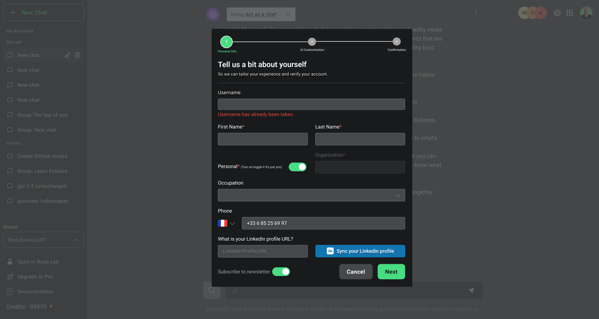
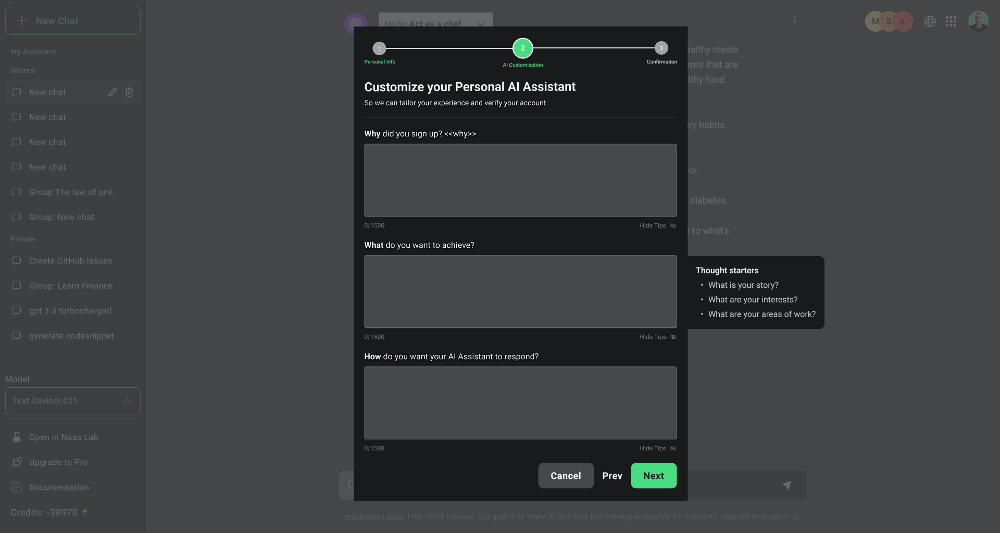
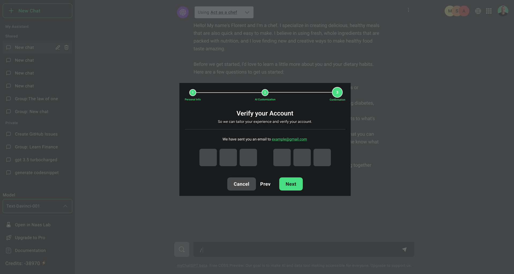

# Onboarding
---

To start your journey with the NAAS Platform, initiate the setup of your user profile. This step ensures a tailored experience across the platform, optimizing interactions with both AIA and ABI for business efficacy.

## Personal Information
Go to the NAAS Platform's homepage https://www.naas.ai and locate the "Sign Up" button. Complete the registration form with essential details: username *(Roadmap)*, first name, last name, organization, occupation, phone number, and synchronization of your LinkedIn profile *(Roadmap)* if you want to automatically tailor your onboarding to your professional profile.

## Personal AI Assistant Customization
*(Roadmap)*
After the personal information form, you'll be able to configure the personality of your AI Assistant (AIA). You will need to answer 3 questions: why you signed up for, what you want to achieve, and how you want the AI to respond in terms of writing style. If you have sync your LinkedIn profile, those 3 questions will be pre populated.

## Enhanced Security Setup
*(Roadmap)*
For enhanced security measures, we will send verification code to your phone number. This security protocol incorporates sending a 6-digit verification code, enhancing account protection with two-factor authentication.

