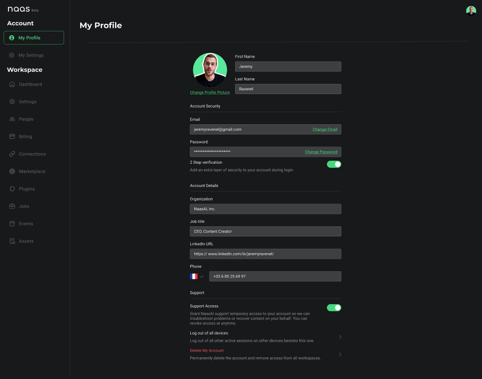
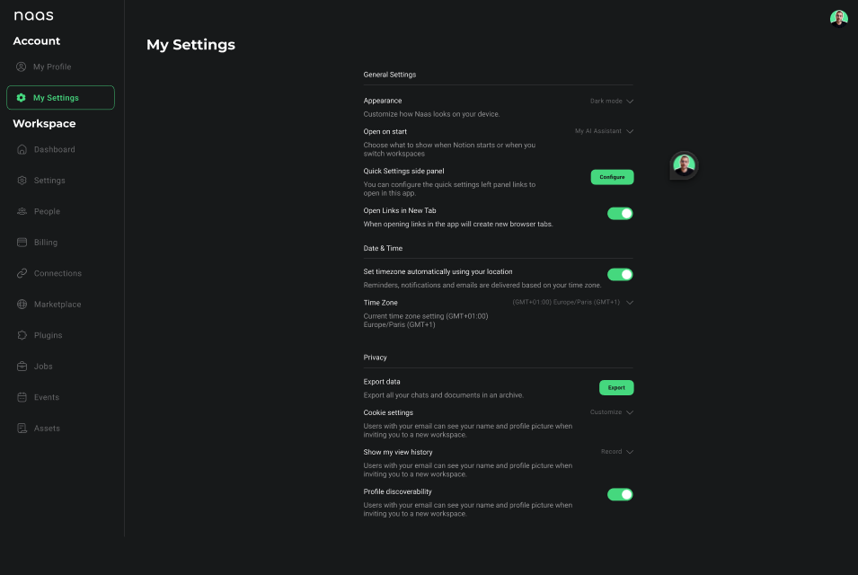

# Account setup
---
In the account settings, you will find everything you need to personalize your profile and tailor your workspace settings, ensuring a seamless and secure experience tailored just for you.

## My Profile

The "My Profile" section is your personal information on the NAAS platform, allowing you to manage your account details, security, and support preferences.

### Account Details
- **Organization**: The name of your company or affiliation.
- **Job Title**: Your role within the organization.
- **LinkedIn URL**: Your professional LinkedIn profile link.
- **Phone**: Your contact number for direct communication.

### Account Security
- **Email**: Your primary email address for login and communication.
- **Password**: Secure your account with a strong password.
- **2-Step Verification**: Add an extra layer of security during login.

### Support
- **Support Access**: Grant temporary access to NAAS support for troubleshooting.
- **Log Out of All Devices**: Secure your account by logging out from all devices.
- **Delete My Account**: Permanently remove your account and associated data.

## My Settings

The "My Settings" section provides various options to customize your NAAS platform experience. Most of the items on the *(Roadmap)*.

### General Settings
- **Appearance**: Customize how NAAS looks on your device, with modes like Dark or Light.
- **Open on Start**: Decide what NAAS shows when starting or when switching workspaces.
- **Quick Settings Side Panel**: Configure quick settings panel links to open within the app.
- **Open Links in New Tab**: Enable or disable opening links in new tabs within the app.

### Date & Time
- **Time Zone**: Set your preferred time zone for reminders, notifications, and emails.

### Privacy
- **Export Data**: Download your chats and documents.
- **Cookie Settings**: Manage your preferences for cookie usage on the platform.
- **Profile Discoverability**: Choose whether users can see your name and picture when invited to workspaces.

### Custom Assistant
- **My AI Assistant**: Select and configure your personalized AI assistant and edit the 3 custom instructions captured during the onboarding. 

Ensure that you review and update your profile and settings regularly to keep your account secure and to get the most out of your NAAS platform experience.