# Workspace setup
---
By default, we will create a Personal Workspace for you. Each workspace serves as a hub for organizations, project management and collaboration. Tailoring these workspaces to align with you, your team's objectives and workflows is pivotal for maximizing productivity and leveraging the platform's capabilities.

## Workspace creation
From the profile dropdown, access your personal workspace or create a new one for your team. When you click on “+ New Workspace”, you can assign a name to your workspace, invite collaborators via email, and define the workspace's scope. The flexibility to establish multiple workspaces allows for the segmentation of projects and team collaboration.

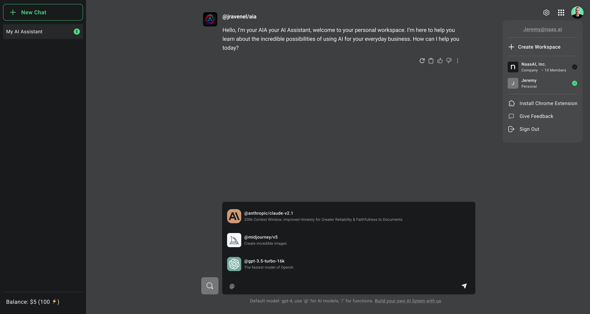

## Dashboard
The dashboard provides an at-a-glance overview of your workspace, with all the credits consumptions happening on the platform. We also plan to add customizable reports for monitoring key metrics, activity feeds, calendars, and quick access to frequently used tools and resources.

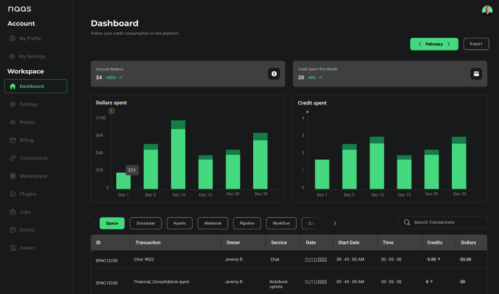

## Settings
Customize your workspace to reflect your company's brand identity and operational needs. This includes selecting themes, configuring widgets for quick access to frequently used tools or data, and adjusting notification settings for critical updates.

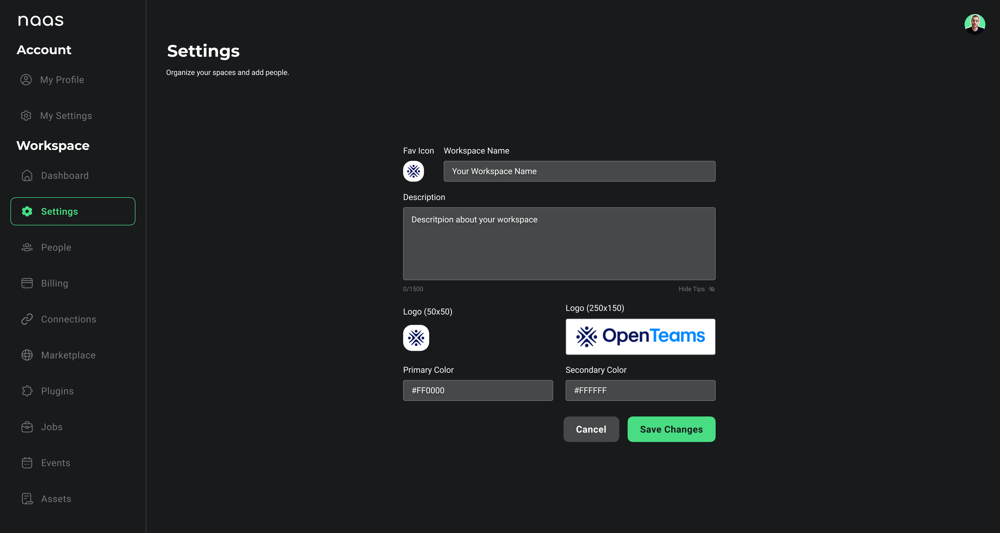

## People
Invite team members, contractors, or clients to collaborate within your workspace. Define roles and permissions to control access levels to different workspace areas and resources.

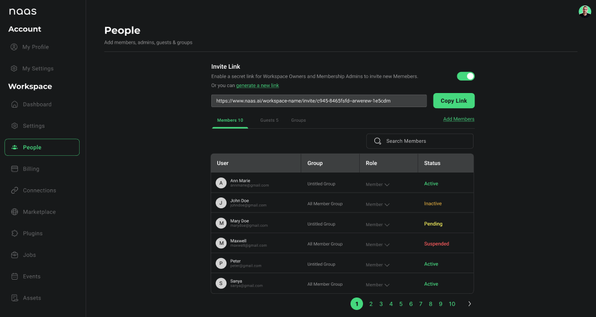

## Billing 
Configure billing at the workspace level to manage platform usage and related costs efficiently. This approach ensures transparency and facilitates budgeting, regardless of whether you're a solo user managing a personal workspace or part of a team managing shared resources.

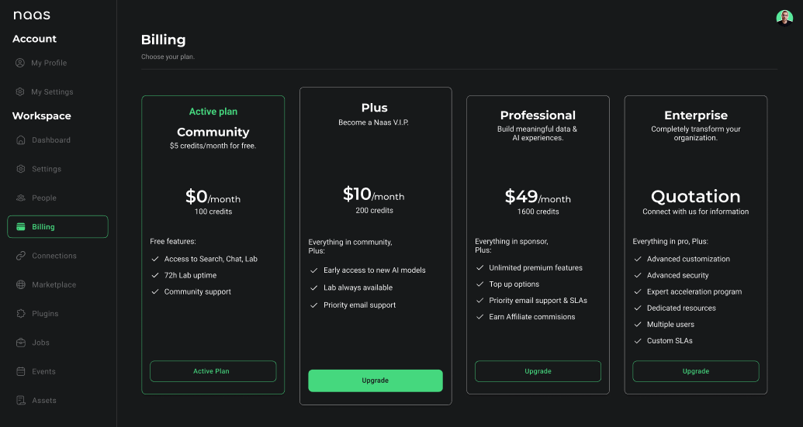

## Connections
In the Connections panel, you can establish links to a variety of platforms, enabling seamless integration and access to your data across different services.

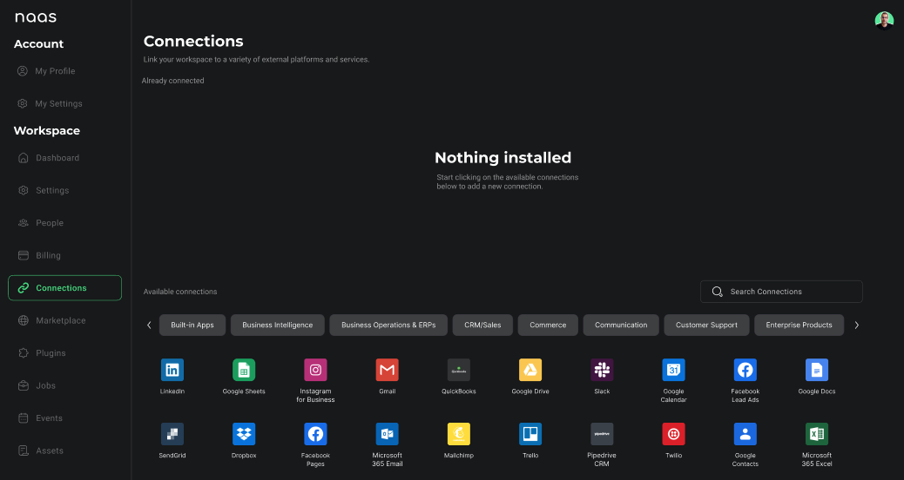

## Marketplace 
The marketplace is a feature designed to enhance your account by providing a curated selection of products and services. By browsing the marketplace, you can easily discover and install AI models, functions, assistants or applications that complement and extend the functionality of your workspace. This allows for a more customized and efficient experience, tailored to meet your specific needs and integrate AI into your workflows.

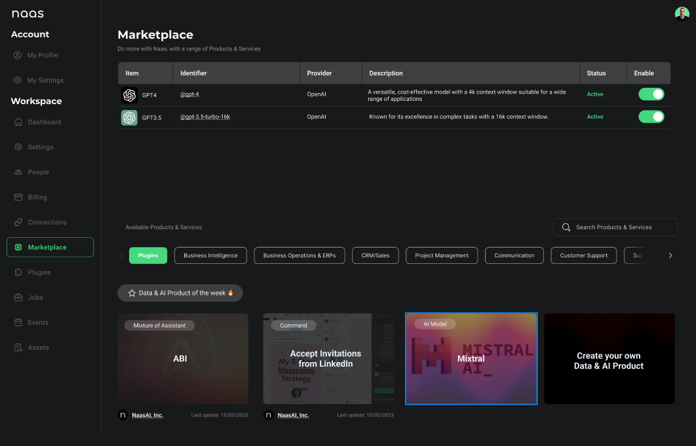

## Plugins
Extend your workspace functionality by installing plugins from the integrated marketplace or developing custom plugins using the API. Plugins enable integrations with third-party apps, data sources, AI models, and more.

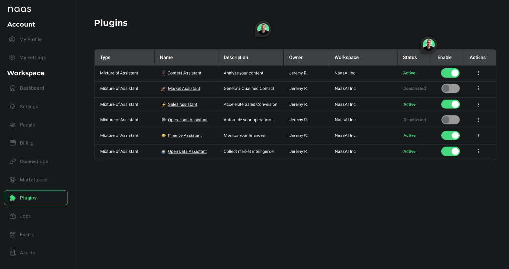

## Jobs
Automate tasks and long-running jobs using the built-in job scheduler. Monitor active jobs, view logs, and receive notifications on job statuses.

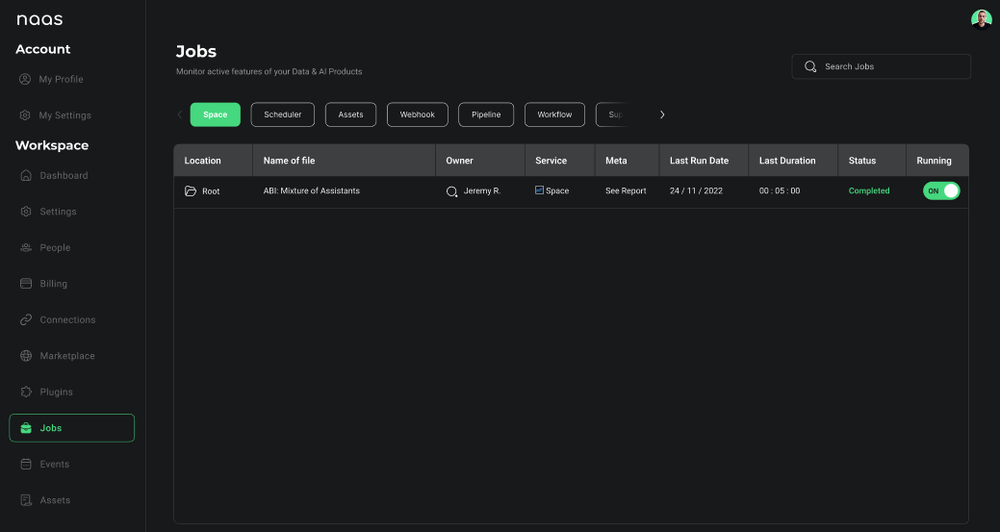

## Events
A comprehensive view of all the events and activity logs related to jobs running within your workspace. This allows you to monitor and audit job executions, track progress, identify issues, and gain insights into your automated workflows.

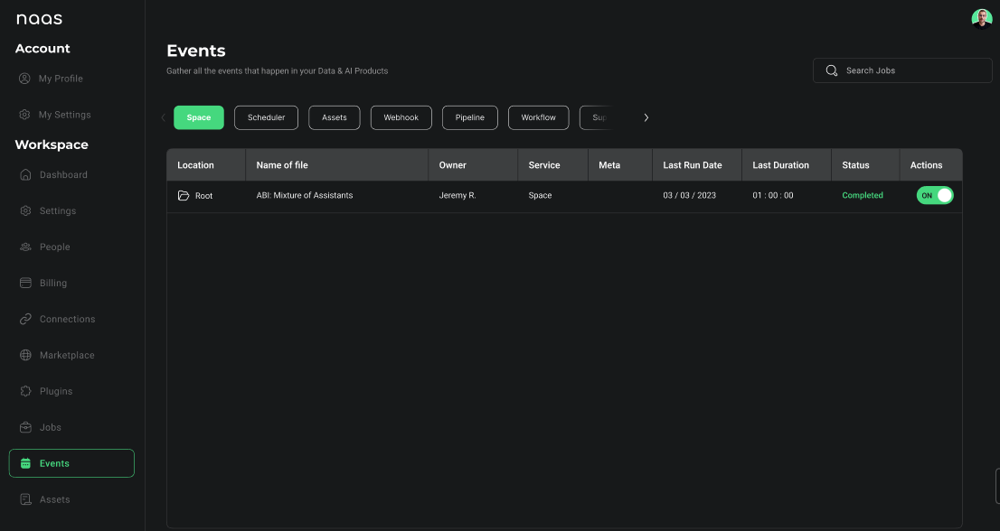

## Assets
Organize and manage all your digital assets - documents, media files, data sources, models, and more - within your workspace's centralized asset library for easy access and collaboration inside the platform.

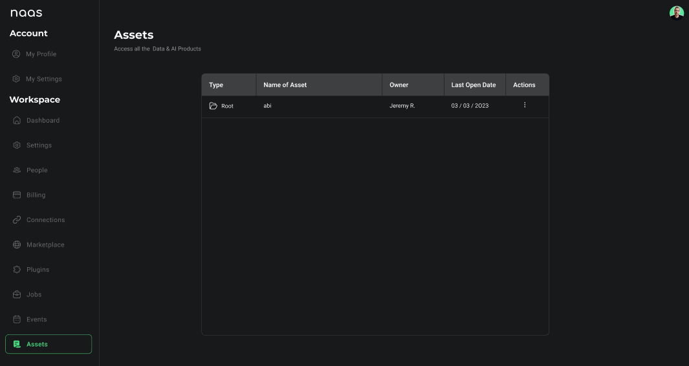