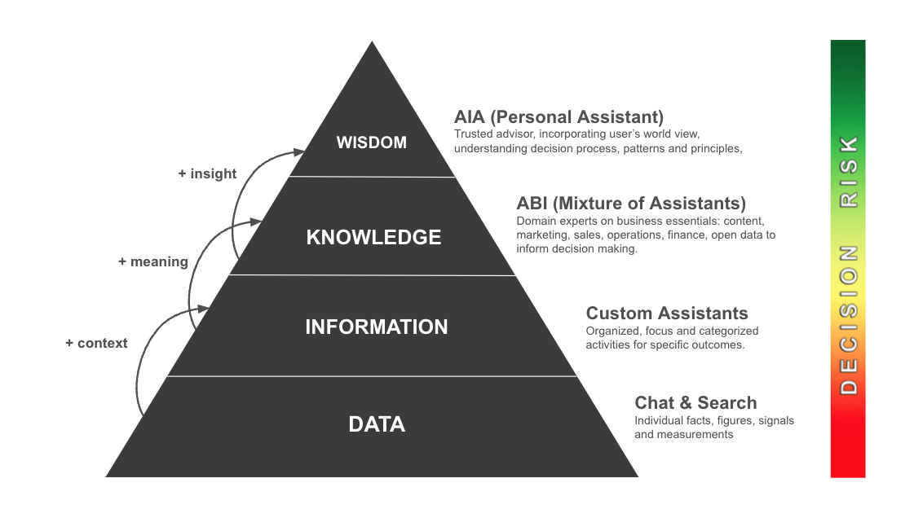

# Build Trust in AI
---

## Embracing the DIKW Pyramid

The journey from raw data to actionable wisdom is both complex and transformative. At NAAS, we've meticulously designed our platform to guide you through this journey, embodying the Data, Information, Knowledge, Wisdom (DIKW) framework at its core. This “pyramid of data needs for decision making” has been the foundational framework on which companies like Google have been built. 

We are adding our take to it focusing on decision making and trust you can build with AI systems: the wisdom level at the top of the pyramid is your personal AI trusted assistant (AIA), AIA works with ABI: the mixture of domain experts on content, marketing, sales, operations, finance and opendata, providing specialized and contextualize knowledge that is interconnected to reason around business problems from awareness to cash, then comes the custom assistants that can be chained together to achieve specific outcomes. The base of the pyramid is about general chat with foundation AI models and search for knowledge assets. Our approach doesn't just manage data; it elevates it to empower decision-making and drive business growth.