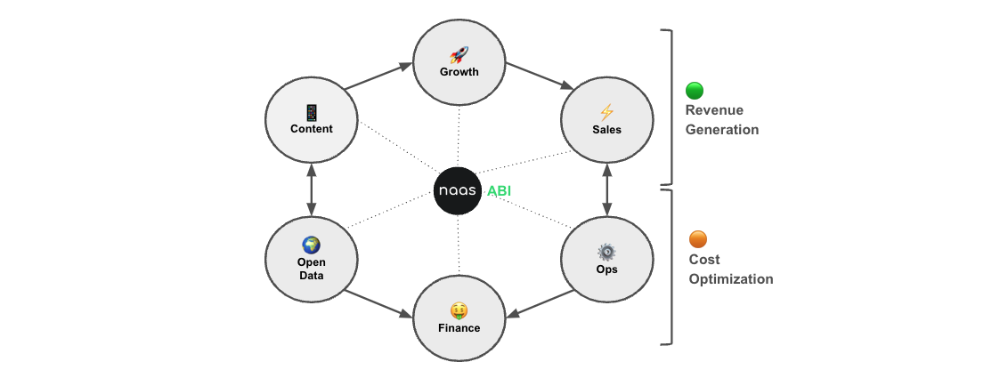

# Map Business Knowledge
---

## Mapping Business Knowledge: From Awareness to Cash Flow

Cash flow is the lifeblood of any business, and at NAAS, we believe in owning and safeguarding this vital process through strategic alignment across various domains. ABI, our Mixture of Assistants, is engineered to create a cohesive network that seamlessly transitions from content creation to cash generation, minimizing friction and maximizing efficiency.

* **Open Data Assistant for Strategic Adaptation:**  The Open Data Assistant is key to maintaining the agility of your business's strategic response. By integrating real-time market events and trends into the ABI system, it enables proactive adjustments in the management of prospects and clients. This real-time insight not only safeguards against potential churn but also identifies opportunities for upselling.
* **Content Assistant as the Engagement Driver:** At the forefront of generating awareness, the Content Assistant plays a pivotal role in expanding the contact network. By producing resonant content that sparks conversations on social media, it transforms passive viewers into active leads, laying the groundwork for deeper engagement.
* **Growth Assistant for Network Expansion:** The Growth Assistant takes the baton from Content, analyzing social interactions to evolve leads into marketing qualified leads (MQLs). It assigns scores to interactions, prioritizing contacts based on their engagement levels and potential fit with your business's offerings.
* **Sales Assistant for Personalized Conversion:** MQLs become Sales qualified leads  (SQLs) based on the match against your Ideal Customer Profile and the Sales Assistant automates first message suggestion, deal creation, and sales activity logging, ensuring that high-potential leads are nurtured towards conversion.
* **Operations Assistant for Workflow Efficiency:** The Operations Assistant ensures that the journey from SQL to customer is seamless. It records operational events, manages meeting schedules, and captures the essential data that informs the most pertinent steps of the customer journey (ie: follow ups messages, push promotions, trigger support events).
* **Finance Assistant for Cash Flow Generation:** Following the progress of the deal, the Finance Assistant prepares the contractual documents, invoices, and payment transactions. It's a critical component in converting successful sales into secured revenue and cash flow, ensuring the financial loop is closed efficiently, and explainable easily.

By interlinking these six essential components of ABI, businesses can effectively increase revenue and optimize costs. The goal is to generate and protect cash flow, reducing friction and promoting synergies. In doing so, ABI empower businesses to not just generate cash but to do so with stability and foresight, prepared for both the expected and the unexpected.

Learn about the different Assistants in details on the following section, [ABI: Mixture of Assistants](usage/abi/introduction)
