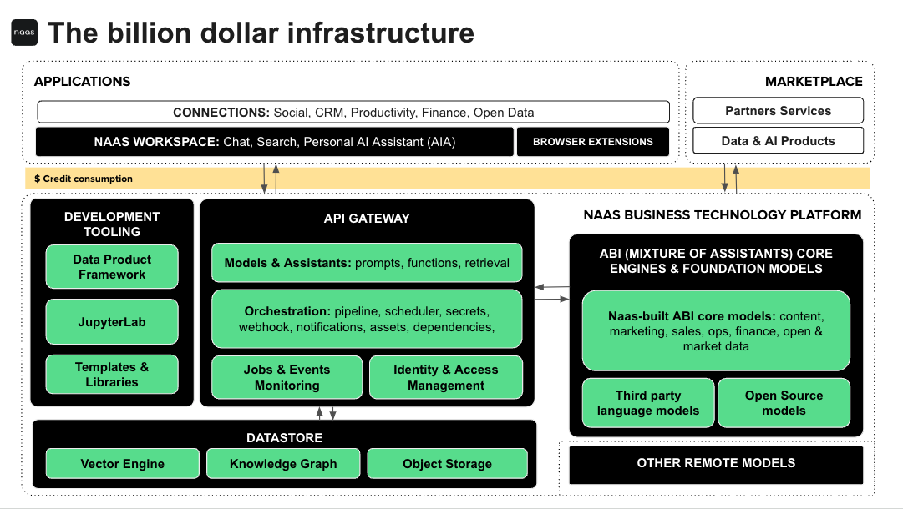
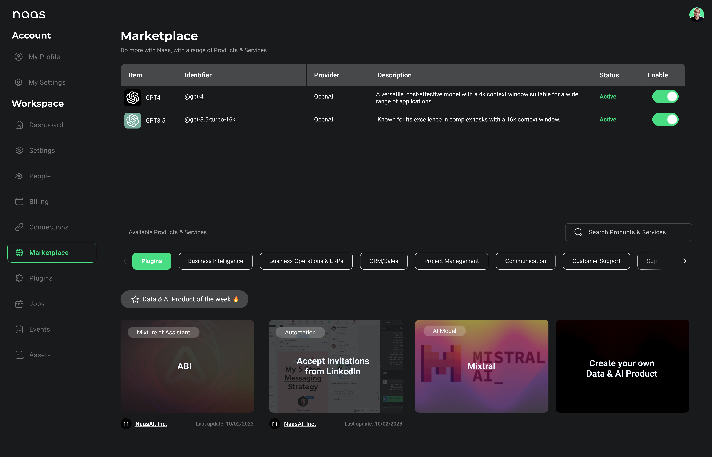

# Unlock Monetization
---

The NAAS platform offers a distinctive path for users to unlock monetization opportunities through the development and sharing of custom AI Assistants and tools within our Marketplace. By leveraging the Data & AI Product Framework, users can create specialized solutions that cater to specific industry needs or general productivity enhancements. Once developed, these solutions can be published in the NAAS Marketplace, either in Public Mode, accessible to all platform users, or in Private Mode, intended for a select audience or specific organizational use.

This ecosystem not only facilitates the exchange of innovative solutions but also provides a venue for creators to monetize their developments. By setting a price for their products or offering them on a subscription basis, developers can generate revenue while contributing to the community's growth and diversification of available tools. The Marketplace acts as a shopping mall within the NAAS platform, enriching the user experience with a plethora of tools, services, and applications, all while fostering an environment of collaboration and financial opportunity for developers.

Embrace the chance to transform your unique ideas into profitable ventures by contributing to the expanding library of resources in the NAAS Marketplace, and start benefiting from the platform's dynamic and supportive ecosystem.

