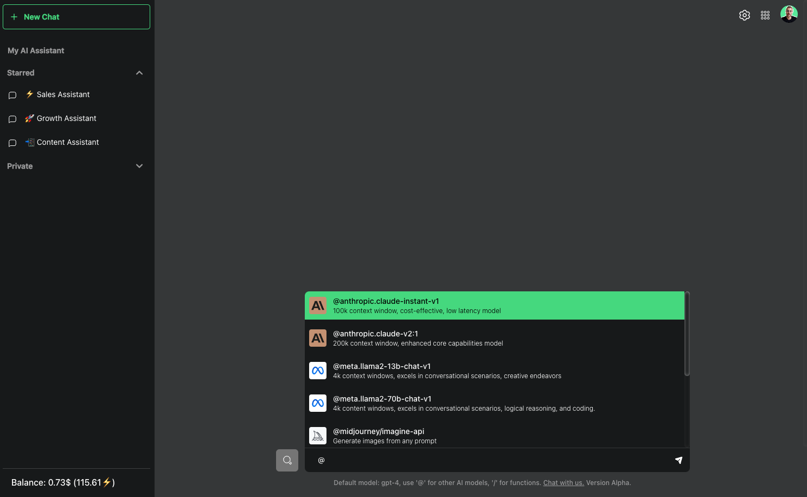
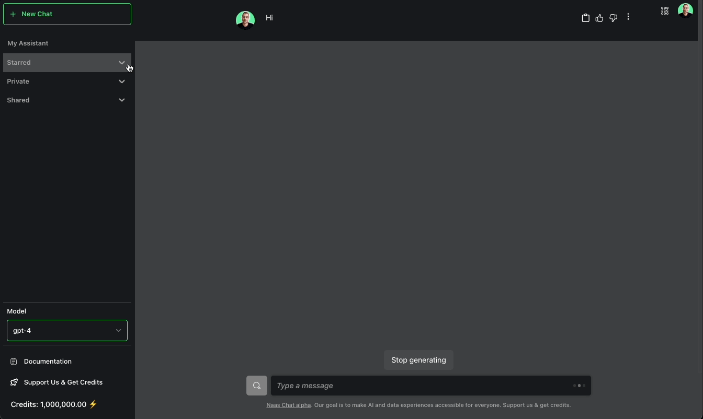

# Chat
---

A single chat interface to work with all the generative AI models.

## Context

The main motivation for the creation of this AI Chat Interface is to offer an alternative to ChatGPT. While ChatGPT has revolutionized the interface, making it simple and user-friendly, it falls short in terms of flexibility. It doesn't allow users to experiment with different open-source models available or integrate to their data and workflows easily. That's where our AI Chat Interface comes in. It aggregates various models into a single interface, and allow the creation and easy distribution of custom data and automation plugins for a more extensive and customizable Data & AI experience.

## Benefits

### Jump Into a New Era of Interactions with AI

We've looked at the current landscape and seen the limitations. Platforms like chatGPT are fantastic, but they don't go far enough. They don't let you play with the plethora of open-source models available. They don't let you truly make the experience your own and intergrate it with your data and your workflows.

That's why we've built our AI Chat Interface. It's not just an aggregation of different models. It's a whole new playground for you to explore, experiment, create and scale your data & AI products.

### Text to Anything

Naas AI Chat Interface isn't just a tool. It's a companion. It's there to help you, to guide you, to make your life easier. And it's not just for you. You will soon be able share it with others and invite different models with different domain expertise to interact with each other, generate text and soon images, audio, video. This isn't just a chat interface, it’s the gateway to your own AI system. 

### One Billing System to Rule Them All

We've integrated a unified billing system into our chat interface. All the API calls done to our services to access language models, all the resources consumed to automate workflows and data products executions, are monitored under one common aggregation system as transactions, labelled in credits amount and in dollar value.

### Seamless Integration

We've taken the power of Python notebooks and integrated it into our chat interface. This isn't just a chat interface. It's an gateway to a Lab where you can experiment, innovate, and create custom plugins to boost your productivity.

### The Power of Plugins

Imagine being able to customize your chat experience with a simple “/” command. Imagine having access to a vast array of functions, from prompts and workflows to full-fledged products. With our AI Chat Interface, this isn't a dream. It's a reality.

And it doesn't stop there. You can build your own plugins. You can add your own logic, your own workflows. You can truly make the interface your own.

### A Plugin Store for Everyone (coming soon)

We're not just building a chat interface. We're building an ecosystem. An ecosystem where anyone can create their own plugins. An ecosystem where you can monetize your creations. This isn't just an alternative to OpenAI's ecosystem. It's a leap forward.

## Features

### Central Panel

- A clean, focused space dedicated solely to the chat, putting your conversation at the forefront.

### Sidebar Features

- A new chat button for starting new conversations with ease.
- 'My Assistant' for personalized AI interactions that remembers and retains your profile information.
- The ability to switch between different models like 'GPT 4', 'GPT 3.5', 'Llama' by default, more if you become sponsor.
- Private and shared conversations feature that allows you to share your AI conversations with colleagues or friends.
- Access to documentation and a button to sponsor us and get more credits.
- A unified billing system for easy tracking of the amount of credits consumed.

### Chat Panel

- Send any kind of message and leverage the power of generative AI models.
- The capacity to extend with plugins, opening up endless possibilities for human and AI interactions.

### Chat Bar

- Supports plugins, allowing access to a variety of functions using a simple slash command.
- From prompts and workflows to full-fledged products, these can be tailored to fit your business needs.

### Actions Bar

- Interconnected with the lab, enabling creation of your own plugins using Python notebooks.

### Plugin Store (Coming Soon)

- A comprehensive marketplace of plugins allowing anyone to create and will be able to monetize their own plugins.
- Fostering an alternative ecosystem to that of OpenAI.

## Conclusion

Naas Chat is not just a tool - it's a revolution. It's about redefining the way we interact with AI and unlocking endless possibilities. We're not just building a chat interface. We're building the future. A future where businesses can leverage the full potential of AI and data. A future where you are in control.

Welcome to the future. Welcome to our AI Chat Interface.