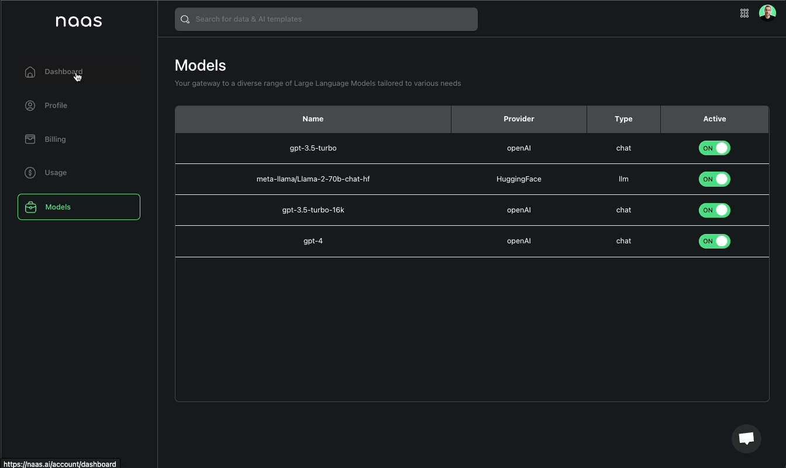
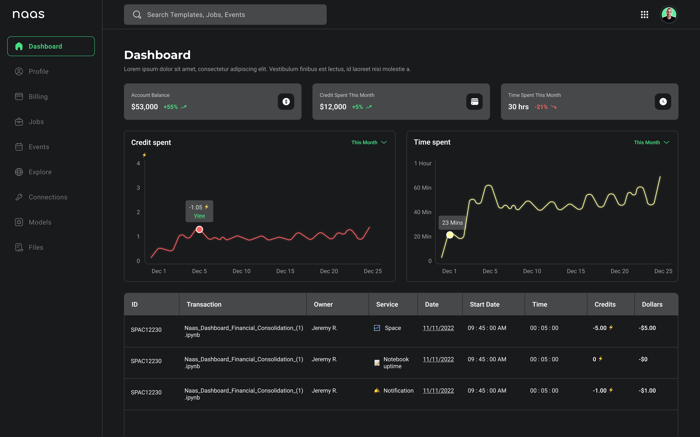

# Account Administration
---

## Context

Equip your team with the Admin Dashboard module, designed to provide you with a centralized, easy-to-use interface for managing and monitoring the various aspects of your data products and workflows. Gain valuable insights into your system’s performance, resource usage, and events, all from a single, unified dashboard.

## Benefits

### Comprehensive Monitoring

Keep track of your data products, workflows, and system executions with the platform’s built-in monitoring tools. Visualize key performance indicators, track resource usage, and identify bottlenecks or issues in real-time.

### Job and Event Tracking

Stay informed about the status of your jobs, tasks, and events with the platform’s integrated tracking features. Monitor the progress of ongoing tasks, review historical data, and receive notifications about important events, all within the Admin Dashboard.

## Unified Billing

All you API calls and jobs execution costs are centralized at the same place giving you complete overview of the total cost of ownership of your data products and AI systems

### Resource and Credit Consumption Management

Gain insights into the resource usage and credit consumption of your projects and teams. Optimize your workflows, allocate resources efficiently, and ensure that your data products stay within budget.

### Access and User Management

Manage access to your platform, data products, and other resources with granular control. Add or remove users, assign roles, and configure permissions to ensure that your team members have the right level of access to the tools and resources they need.

### Customizable Interface (coming soon)

Tailor the Admin Dashboard to display the information and insights that are most relevant to your team and your business. Configure the layout, widgets, and visualizations to create a personalized dashboard that meets your unique needs.

## Features

### Account Manager

The account manager feature accessible from the Workspace when you click on the profile dropdown, will lead you quickly to the key things you need to manage in the platform: dashboard, profile info, usage, billing, models, and much more to come.

### Dashboard

The dashboard section lets you see the current account balance, credits spent and time spent this month with the evolution. It will then deep dive into the trends with graphs and show the last transaction detailed in a table. 

(Coming Soon)

### Profile

The profile section enables you to capture all your personal details, name of organization, and time zone but also custom instructions to help the AI models in the chat create a more tailored experience. 

### Billing

The billing section will show the plan you are currently in and enable you to manage this plan using the customer portal linked to our Stripe account for payment and plan management. 

### Usage

The usage section is a true bank account statement giving an exhaustive overview of all the AI models and jobs, quantity, price, total costs in credits and dollar value.

### Jobs

The jobs section enables monitoring of all currently active jobs in production like scheduler, asset, webhook, and notification. (currently accessible in the Lab Manager)

### Events

The events section accesses the logs of all your job executions and catches error messages for easy debugging. (currently accessible in the Lab Manager)

### Models

The models section is a gateway to a catalog of Large Language Models available to address diverse needs

## Conclusion

The Account Administration feature enables users to manage resources, monitor performance, and optimize workflows, all from a single, easy-to-use interface. With the Account Administration interface, you can ensure that your team stays efficient, productive, and focused on delivering value to your business.