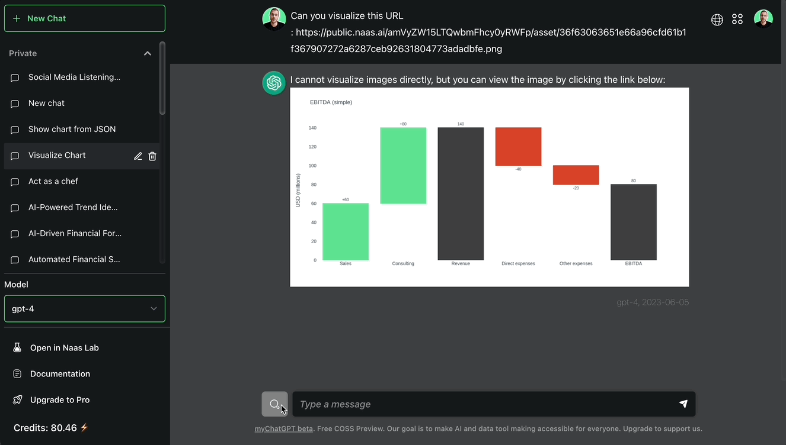

# Analytics & Dashboarding
---

Activating fast decision-making

## Context

Naas has powerful analytics and dashboard capabilities designed to empower businesses and development teams to create, manage, and share data-driven insights through interactive and visually engaging charts and dashboards. This page provides an overview of how to generate and share insights with stakeholders in a secure and controlled manner.

Whether you're a small business just starting with data analysis or a large corporation with complex data needs, Naas has something to offer.

## Benefits

### Fast & Efficient Decision-Making

Naas provides a faster solution for generating and sharing insights, by empowering development teams, businesses, and managers. Development teams can use the power of Notebooks and our catalog of templates to quickly build charts and dashboards right from their development environment and create a secured sharing link that managers can receive to access insights and informed decisions, improve business operations, and drive growth.

### Easy Sharing of Data and Insights

Naas allows businesses to share data and insights with relevant stakeholders in a secure and controlled manner with the secured sharing link. This ensures that the right information reaches the right people at the right time. It eliminates the challenges of data silos and promotes transparency and collaboration within the organization. The secure sharing link feature called assets ensures that sensitive business data remains protected while being shared.

### Integration to BI tools

Users can create their own datasets that can feed their dashboards or BI tools (PowerBI, Tableau). This feature allows businesses to customize their data analysis based on their specific needs. Once the datasets are created, they can be shared using the NAS asset feature. This promotes collaboration as different team members can work on the same dataset and contribute to the data analysis process.

### Deployment of Custom Dashboards

Naas allows easy deployment and sharing of dashboards on serverless. Once the dashboard is ready, it can be made accessible to different people using the space feature. Users can share a specific link, manage access control, and enable others to access the data. This feature ensures that the dashboards reach the intended audience, facilitating effective data communication within the organization.

### Seamless Chat Integration

The Naas is seamlessly integrated into the chat, allowing users to distribute assets through the chat very naturally. This feature enhances the user experience as users can share and discuss data insights within the chat. It promotes real-time collaboration and discussion, leading to more effective decision-making.

## Features

### Pre-built Chart Templates

The pre-built chart templates guide users in creating effective visualizations. These templates leverage different Python libraries (Matplot, Plotly, Seaborn) and can be used to represent data in various forms such as line charts, bar charts, and many others. Having a ready-to-use template not only saves time but also ensures that the visualizations are accurate and effective. 

### Asset Sharing

Each of the charts in HTML or PNG format that are generated using the Chart Templates or your own code can be shared to the world using the asset low-code function. The function generated a secure public URL link that can then be integrated anywhere.

### Dashboard Staging

Use the power of the Lab to build dynamic, interactive, and data-driven dashboards that clearly communicate insights and tell a compelling story using Dash, Streamlit, or other Python libraries. Easily integrate data from various sources and apply advanced data preparation and orchestration techniques with the Pipeline low-code function to create insightful visualizations that meet your business needs. 

### Dashboard Deployment

You can effortlessly deploy Dashboards to a dedicated Space. This provides a stable and secure environment for hosting and sharing your insights. Spaces guarantee easy accessibility, quick loading times, and adequate resources for a smooth user experience.

### Plugin System: Chat Commands and Lab Features

Develop plugins with your custom data for tracking analytics and integrate them into the chat system using the '/use' command. Use the '/refresh' command to update your data. Leverage the lab features with pre-built templates, enabling you to refresh your data daily with the 'scheduler' feature, integrate images into your chat using the 'asset' feature, and trigger data refreshes using the 'webhook' feature.

### Access Control and Sharing

Manage access to your Spaces with granular controls, allowing you to restrict access to specific users or groups, or make your dashboards publicly available. Share your insights with internal teams, external stakeholders, or the broader public in a controlled and secure manner.

### Collaboration and Feedback

Foster collaboration by enabling team members to provide feedback and suggest improvements to the dashboards with the Chat feature. This iterative approach allows you to collect feedback from the chat and refine your dashboards pro-actively, making them more accurate, relevant, and impactful over time without any friction.

### Scalable Infrastructure

As your needs evolve, the platform automatically scales to accommodate increased data volume, user traffic, and dashboard complexity, ensuring a consistent user experience.

## Conclusion

By incorporating the Analytics and Dashboard Deployment feature into their workflow, businesses and development teams can transform raw data into actionable insights that inform decision-making and drive growth. This powerful approach enables users to build impactful dashboards, deploy them in dedicated Spaces, and securely share them with relevant stakeholders, harnessing the power of data in an efficient and secure manner.