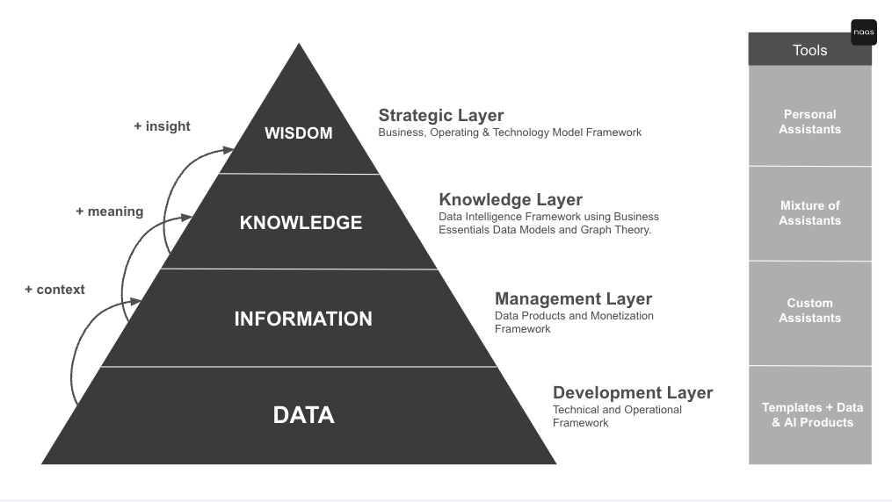
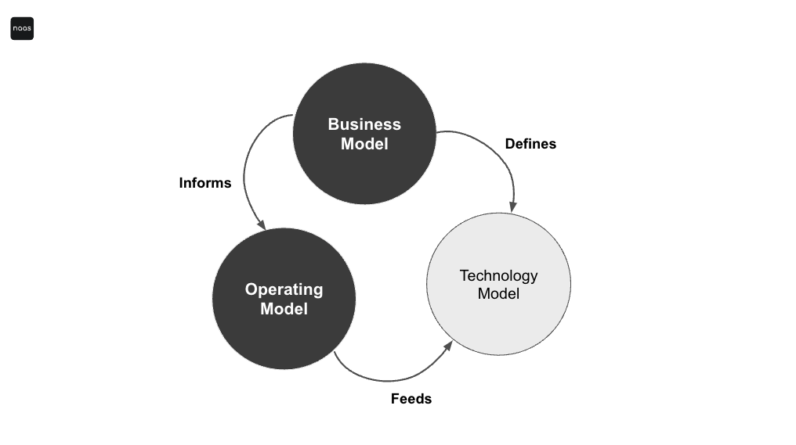
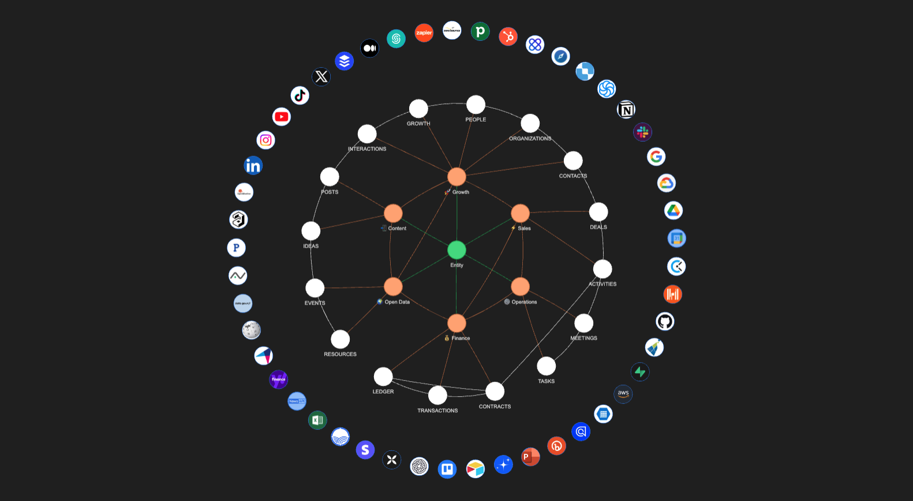
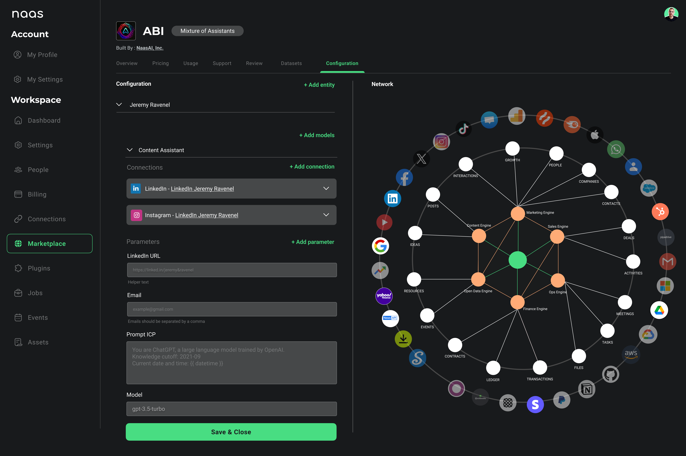
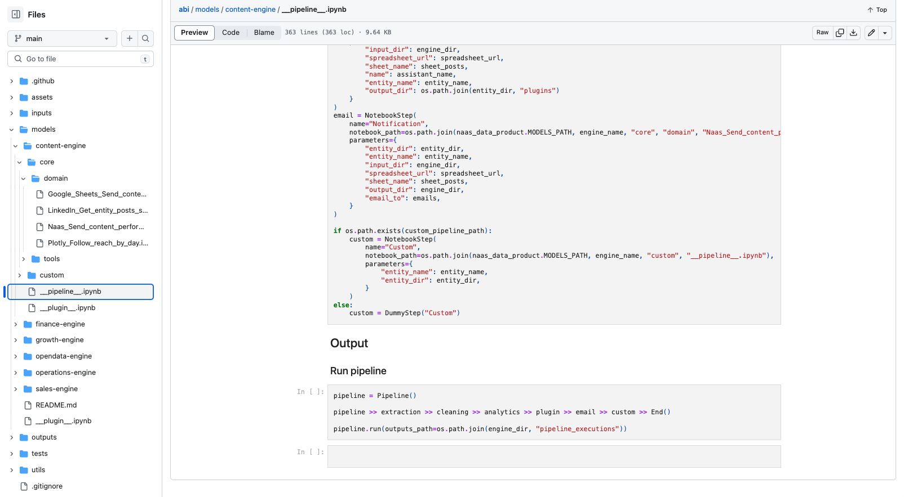

# Frameworks
---

NAAS Platfom enables your to integrate technology and AI within business models. The frameworks are categorized into 4 distinct layers: Strategic, Knowledge, Management, and Development.

## Strategic Layer
*The Business, Operating & Technology Model Framework*

The Strategic Layer aligns AI technology with business models to drive corporate strategy and long-term growth.
This framework inspired by Vin Vashishta’s work on the Technology Model, integrates technology strategy with the ongoing transformation of business and operational models. It's where technology is not just applied but is woven into the fabric of business to create value, drive ROI, and catalyze growth. 

Personal Assistants, informed by this model, guide decision-makers through transformational strategies that affect workflows, tool adoption, and capability building across the enterprise. This layer is pivotal for maintaining a connected journey of technology maturity, ensuring cohesive growth and strategic alignment that is responsive to the ever-evolving business landscape. It empowers organizations to navigate complexity with agility, making strategic decisions that resonate from the frontlines to the C-suite, ultimately accelerating productivity and cost savings with a forward-looking stance on technology.

## Knowledge Layer
*The Mixture of Assistants Framework*

The Knowledge Layer connects the higher-level strategic frameworks to the more granular management and development layers, ensuring that decision intelligence is enabled in every aspect of the platform.

#### Mapping Business Knowledge with Assistants:
Mixture of Assistants Framework is the cornerstone of this Knowledge Layer as it's designed to facilitate the construction of an entity's (person or organization) AI Operating System using knowledge graphs and AI Assistants features. AI Assistants capitalizes on the concept of engines that operates on universal data tables — such as ideas, posts, interactions, growth, contacts, deals, conversations, tasks, transactions, ledger, events, and resources — to aggregate, further customize and interlink information across various business domains:

- **Content Creation**
- **Growth Marketing**
- **Sales Conversion**
- **Operational Efficiency**
- **Financial Management**
- **Open Data & Market Intelligence**
  

It utilizes the vast expanse of global data that a Mixture of Experts Large Language Model (LLM) is trained and combines it with a Mixture of Asssistants that possess unique organizational data insights.

#### Data Layers for Busines Knowlege Essentials:
- **Ideation to Execution**: Tables like 'IDEAS' and 'POSTS' trace the journey from concept generation to content distribution, supporting creative workflows.
- **Interaction to Growth**: From 'INTERACTIONS' to 'GROWTH', data is harnessed to understand customer engagement and inform targeted marketing strategies.
- **Contact to Contract**: 'CONTACTS', 'CONVERSATIONS', and 'DEALS' work in tandem to refine the sales process, from lead capture to deal closure.
- **Task to Transaction**: 'TASKS' and 'TRANSACTIONS' drive operational and financial activities, ensuring that everyday processes align with business health and objectives.
- **Event to Insight**: 'EVENTS' and 'RESOURCES' provide intelligence from the open data sphere, feeding into market strategies and competitive positioning.

## Management Layer
*The Data Products and Monetization Framework*

The Management Layer serves as a critical bridge between strategic oversight and practical application, with a sharp focus on transforming knowledge into valuable assets. 

This layer emphasizes the monetization of data through the creation and deployment of data products, ensuring that knowledge transcends its theoretical confines to generate tangible economic value.

Within this ecosystem, knowledge that doesn’t qualify as confidential can be repurposed into marketable assets, with the aim to be distributed on the NAAS Marketplace. This approach optimizes the utility of data but also opens up new revenue streams. It is where the potential of data is realized and monetized, transforming the NAAS platform into a thriving marketplace that facilitates the exchange of innovative solutions and insights. Product needs to comply with this structure.

- **Summary**: A concise overview of the product, highlighting its key features and benefits.
- **Pricing**: Detailed pricing information, including any tiered structures, subscription models, or one-time fees.
- **Usage**: Clear guidelines on how to use the product, along with any system or software requirements.
- **Datasets**: Information on the datasets included with the product, their sources, and how they can be leveraged.
- **Configuration**: Instructions on how to configure the product to fit specific user environments or integrate with other systems.
- **Support and Updates**: Information on the support provided and how users will receive product updates.
- **Reviews and Ratings**: Customer feedback to help potential users gauge the product’s effectiveness and quality.
- **Provider Details**: Information about the product creator or company, including their expertise and other offerings.

These details are crucial in ensuring that users have all the information they need to make informed purchasing decisions, contributing to a transparent and efficient marketplace.

## Development Layer

*Technical and Operational Frameworks*

The Development Layer is the technical building blocks for development, utilizing a comprehensive set of templates and components for data analysis and product construction.

#### IMO Framework (Input, Model, Output)
- **Input**: Declare your tools, data collection and ingestion protocols.
- **Model**: Work on data modeling, transformation and analysis.
- **Output**: Deliver plugins, reports, insights, and actionables generated from data.

#### Template Framework
- **Building on IMO Framework**: Templates are built using the IMO framework, they are the component level of a Data Product
- **Breaking down workflows in simple tasks**: Templates should be simple tasks broken down at a the most detailed level possible
- **Community Templates**: The awesome-notebooks templates repository with 3,000+ templates is the asset catalog for building Data Products

#### Data Product Framework
- **Building on IMO Framework**: Data products are built using the IMO framework as a foundation for structure and clarity in data handling.
- **Pre-processing and Post-processing Activities**: Managed by a pipeline file, which orchestrates the data flow from raw input to refined output and a plugin file configuration.
- **Plugins**: Extend functionality and integrate additional features into data products, enhancing their capabilities and user experience/
- **Monetization**: Leverage data products within the NAAS platform credit system for revenue generation, capitalizing on AI-driven operational efficiency.
  

By aligning these frameworks across the strategic, management, and development layers, NAAS creates a cohesive environment that empowers developers, strategists, and business leaders to harness the power of AI. This holistic approach not only facilitates the creation of intelligent data products but also ensures these products are aligned with overarching business goals and can be effectively monetize.

