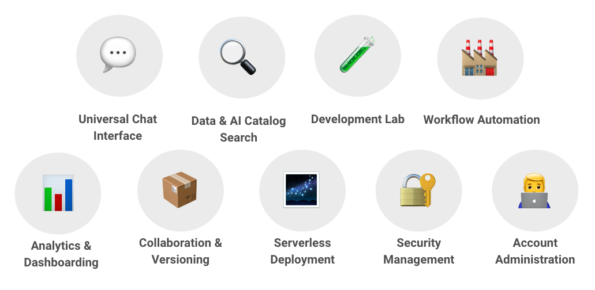

# The All-In-One Experience
---

The All-in-One Experience is a key philosophical engagement of the Naas platform, designed to provide users with a comprehensive and streamlined approach to data and AI. This documentation page covers the various features and functionalities contributing to this all-encompassing experience.

## Naas and The Modern Data Stack

The modern data stack has become a popular concept in the market. It encompasses a range of tools that enable the extraction of data from various sources within an enterprise. The goal is to gather this raw data, often referred to as "bronze" data, and transform it into the refined "silver" data. This process involves orchestrating the data and ultimately delivering it to end users through notebooks or business intelligence (BI) tools, resulting in the valuable "gold" data.

This process requires different tools and processes to be deployed in the infrastructure of the company and can resources to manage it. 

Naas offers a comprehensive platform that is specifically designed for developing data products. While it can integrate with the modern data stack as a data source, it is not limited to it. The platform eliminates the need for users to switch between multiple tools, enabling them to concentrate on gathering the data that truly adds value to their AI systems. By providing an all-in-one solution, Naas streamlines the data collection process and empowers users to focus on leveraging the most relevant and valuable data for their specific needs.

## Covering every data & AI related task

Naas covers every aspect of data and AI-related tasks, aligning with the features known in the modern data stack. However, Naas takes it a step further by enabling the packaging of these features at the data product level. Let's explore each feature and see how they align with the components of the modern data stack:

1. **AI Capabilities**: Leverage natural language processing tasks, machine learning algorithms and models for data analysis, prediction, and automation. This aligns with the data science and machine learning components of the modern data stack.
2. **Chat Interface**: Interact with data and AI functionalities through a conversational interface. This aligns with the concept of collaboration and communication within the modern data stack, facilitating easy access to insights and fostering collaboration among team members.
3. **Data and AI Catalog**: Explore and access a wide range of pre-built data and AI templates. This aligns with the data cataloging and discovery aspect of the modern data stack, making it easier for users to find and utilize relevant data assets.
4. **Development Lab**: Develop and test data and AI workflows. This aligns with the development and experimentation components of the modern data stack, allowing users to iterate and refine their workflows before deployment.
5. **Workflow Automation**: Automate data and AI workflows, streamlining repetitive tasks and improving efficiency. This aligns with the workflow orchestration and automation components of the modern data stack, ensuring smooth data processing and analysis.
6. **Analytics and Dashboarding**: Robust analytics and dashboarding capabilities to allow users to visualize and gain insights from their data. This aligns with the data visualization and reporting aspects of the modern data stack, enabling users to monitor and communicate data-driven insights effectively.
7. **Chrome Extension**: Integrates with your web browser, allowing users to interact with generative AI model and extract data from websites and web applications. This aligns with the idea of self service business intelligence, data extraction and ingestion components of the modern data stack, making it easier to collect data from various online sources when you are browsing.
8. **Collaboration and Versioning**: Naas facilitates collaboration among team members by providing features for sharing and versioning data and AI workflows. This functionality aligns with the principles of self-service business intelligence and the data extraction and ingestion components of the modern data stack. By leveraging Naas while browsing the web, users can effortlessly collect data from diverse online sources.
9. **Serverless Development**: Allowing users to deploy and scale their data and AI applications without managing infrastructure. This aligns with the serverless architecture component of the modern data stack, enabling cost-effective and scalable deployment of data-driven applications.
10. **Security Suite and Admin Dashboard**: Offers a comprehensive security suite along with an admin dashboard for managing user access and permissions. This aligns with the security and governance aspects of the modern data stack, ensuring data privacy and compliance.

By unifying these features, Naas provides a comprehensive solution that addresses the key components of the modern data stack while enabling users to package them at the product level. With Naas, users can seamlessly extract, transform, analyze, and deploy data and AI workflows, empowering them to derive valuable insights and drive business success.

## Streamlining Data and AI

While the modern data stack is effective for massive data collection, it may not be the most efficient approach when it comes to training your own AI system. This is where the all-in-one experience provided by Naas comes into play.

We've incorporated the concepts introduced by the modern data stack into low-code functions. When you combine these functions with our notebooks templates, you can leverage them as building blocks to create data products targeted to specific business needs.

## Leveraging Valuable Data

Naas helps you create your data products & AI ecosystem, focused on extracting the most valuable data, typically around 20% of the total. By tapping into the data warehouse or going directly to the data source using a data mesh approach, we can build custom data and AI experiences and integrate them into different ecosystems.

## Simplified Workflows

The all-in-one experience eliminates the need to juggle multiple tools and instead offers a streamlined approach. By stitching templates together, you can create the right workflow or pipeline for your specific business needs and iterate very fast. This allows you to concentrate on the business outcome without being burdened by technical complexities.

## Distribution and Deployment

Naas offers flexible options for distributing and deploying your data products. Whether you choose to leverage the Naas chat interface or deploy your products somewhere else, Naas provides the necessary tools and infrastructure. You can also create APIs and serverless dockers to enable seamless integration with other systems.

## Supercharged Productivity

Naas's all-in-one experience is designed to supercharge productivity, offering a comprehensive solution that streamlines workflows and enhances collaboration. With Naas, users can focus on their core business objectives without the complexities of managing multiple tools. It provides a centralized platform that caters to both developers and data consumers, enabling easy data access and fostering seamless collaboration. By eliminating the need to switch between different applications, Naas saves valuable time and effort, empowering users to accomplish more and achieve higher levels of productivity. Experience the power of Naas and unlock your full potential for productivity.

## Conclusion

The All-in-One Experience on the Naas platform empowers users to efficiently work with data and AI. By simplifying workflows, leveraging valuable data, and offering flexible distribution options, Naas enables businesses to focus on their goals and achieve better outcomes.