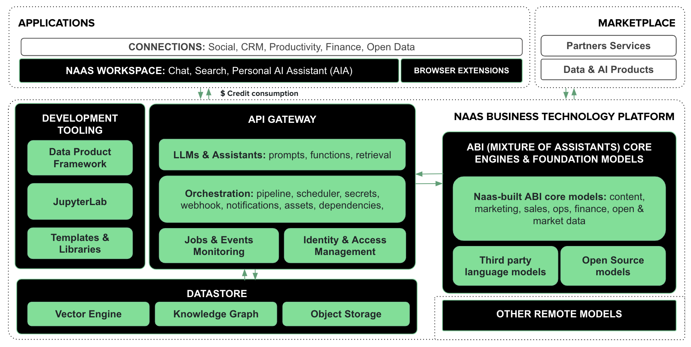

# Components
---
To enhance the architecture overview with a focus on the marketplace, let's develop this section to highlight how the components of the platform integrate and interact, especially emphasizing the creation of data products beyond ABI and the utilization of Naas Space for deployment and monetization:

## Architecture Overview

The NAAS platform is architected to be a comprehensive suite for the development and deployment of Data & AI Products. It serves as the backbone for transforming operational workflows and conversation management into intelligent business solutions.

## Applications Layer
At the user interface level, the **Workspace** acts as a centralized hub for all user activities, from engaging with AI Assistants to accessing development tools and the marketplace. The **Chrome Extension** further extends this functionality, keeping the NAAS platform's features readily accessible alongside browser activity. Connections to **Third-Party APIs** ensure that NAAS users can effortlessly integrate and orchestrate external services, enhancing their operational scope within a single ecosystem.

## Development Tooling
This layer is the foundation for building and managing data products. With the **Data Product Framework** and **JupyterLab Server**, users can create robust data solutions. The inclusion of **Vanilla Libraries** like pandas and TensorFlow, alongside specific **Drivers**, equips developers with a rich set of tools to bring their data products to life.

## API Gateway
As the platform's communication hub, the **API Gateway** facilitates interactions across services, maintaining the platform's cohesiveness. It is secure, leveraging HTTPS and JWT for authentication, and is the integration point for all NAAS features, including the marketplace.

## Identity & Access Management (IAM)
**Secrets Management** and **User Roles** within IAM ensure sensitive data is handled securely and users have clear, defined access to the platform's capabilities, maintaining both security and efficiency.

## Jobs & Events Monitoring
This functionality provides the oversight necessary to maintain the platform’s operational integrity, from application performance to event responsiveness.

## LLMs & AI Assistants
With multiple AI providers at our disposal, the platform's AI capabilities are diverse and powerful, ranging from simple completions to complex AI-driven agents. OpenAPI/API deployments facilitated by **Naas Space** allow for seamless integration and customization of these AI functionalities.

## Orchestration Layer
Comprising the **Scheduler**, **Pipeline**, and **Webhook**, this layer is crucial for managing the platform's automated processes, from data flows to real-time interactions and asset generation.

## Storage & Datastore
Our storage solutions, including an optional S3 compliant service and a **Graph Database**, provide the infrastructure necessary for advanced data management and analysis. The **Vector Engine** enhances the platform's computational capabilities, vital for AI and machine learning applications.

## Marketplace 
The NAAS marketplace is where the true potential of the platform unfolds. Here, users can not only leverage ABI but also create and deploy a multitude of data products. It is a space where innovation thrives, supported by the platform's architecture and driven by user creativity.

### Interface
Deploy tools and assistants effortlessly with **Naas Space**, a feature that democratizes the deployment of specialized assistants within and outside your organization.

### Monetization
The platform’s **Credits-Based System** introduces a transparent and scalable approach to service billing, enabling users to monetize their creations and manage consumption effectively.

By fostering an environment where data products can be developed, deployed, and monetized, NAAS is setting the stage for a new era of digital transformation. Our marketplace is not just an add-on but a central piece of the platform, designed to empower businesses to create, innovate, and grow in the AI-centric landscape.
