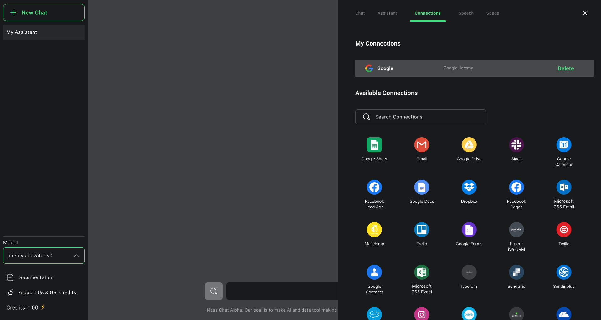

# Security Suite
---

:::tip

Contact us at support@naas.ai if you have any questions or specific requirements you would like us to comply to.

:::

## Context

The Security Suite offered by the Naas platform is designed to help businesses and development teams protect their data products, assets, and workflows. With advanced security features and best-in-class practices, this module ensures the confidentiality, integrity, and availability of your data and resources, providing peace of mind and trust in your data products

## Benefits

### Managed Hosting

We leverage the secure hosting and management capabilities of Amazon Web Services (AWS) via our Virtual Private Cloud (VPC) to create a dedicated and isolated environment for each Lab user. This ensures that user data and assets are protected from unauthorized access and data leakage. With proactive management and adherence to AWS security protocols, Naas provides a secure and reliable hosting environment for user resources.

### Dockerized Environments

Naas implements a systematic approach to dockerization, creating isolated and secure environments for users. Dockerization involves encapsulating each user's lab within a container, providing a self-contained environment that is separate from other users but also when a data product is deployed as a stand-alone instance.

### End-to-end data Encryption

We safeguard your sensitive data both in transit and at rest with industry-standard encryption protocols. Our protocol protects your valuable information from unauthorized access and ensures that only authorized users can access it.

### Authentication and Authorization

Implement robust authentication and authorization mechanisms to manage access to your data products, assets, and workflows. Utilize features such as single sign-on (SSO), multi-factor authentication (MFA), and role-based access control (RBAC) to ensure that only authorized individuals can access your resources.

### Audit and Logging

Every job created on the lab server is audited and logged, enabling the tracking of user actions, changes on assets, and other events for accountability and traceability.

### API Access and Key Management

Services are accessible through API access or access keys, ensuring secure remote access to user labs.

### Compliance and Standards

Naas works towards implementing GDPR and SOC 2 compliance, following best practices for data privacy and protection, helping organizations remain compliant and avoid fines and penalties.

## Features

### Virtual Private Cloud

Naas leverages an AWS-based Virtual Private Cloud (VPC) for secure hosting and management as they provide the highest SLA and guaranteed uptime. The VPC provides a dedicated and isolated environment for our services, ensuring a secure and private network for our users. 

### Dockerized Instances

Dockerization is a first-class citizen to create isolated and secure environments for various services, ensuring that each service operates independently and securely. This approach minimizes the risk of interference and unauthorized access, providing a secure environment for running services on the platform.

### HTTPS routing

Naas implements HTTPS routing, utilizing the HTTPS protocol for secure data transfer and encryption. This ensures that sensitive information is protected during transmission, preventing unauthorized interception. 

### Auth API

The Auth API feature combines multi-factor authentication (MFA), single sign-on (SSO), and role-based access control (RBAC) to enhance user authentication and access control. This feature ensures secure login processes, adds an extra layer of security with MFA, and allows organizations to manage user roles and permissions effectively. 

### Secrets Management

The secret feature enables secure storage of passwords and connection credentials. It ensures that sensitive information is protected and provides a convenient and secure way to manage such data. 

### Jobs Execution Logs

Naas enables audit and logging of user actions and events, providing accountability and traceability throughout the platform. The job execution logs capture and track every job executed on the user instances, ensuring transparency and facilitating compliance. 

### Live Compliance Dashboard

We use the Vanta compliance dashboard to continuously monitor our adherence to industry standards such as GDPR and SOC 2 for data privacy and protection. This live dashboard is connected to our infrastructure, allowing us to track our compliance status in real time. By proactively monitoring and addressing any potential gaps, we ensure that our customer's data is handled securely and in accordance with industry standards. 

## Conclusion

The security suite offered by Naas provides a comprehensive set of features and measures to ensure the security and protection of user data and assets. From secure hosting and data transfer to authentication features and compliance with industry standards, Naas prioritizes the security and privacy of its users. By leveraging these security features, organizations can confidently use Naas for their data analysis needs while maintaining a high level of security and compliance.