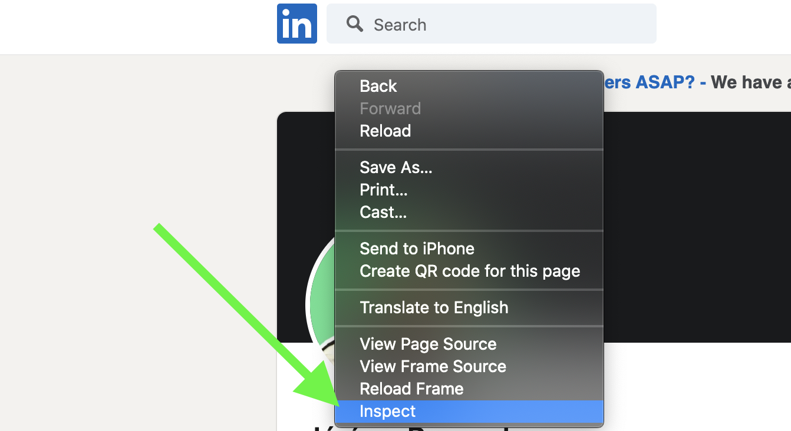
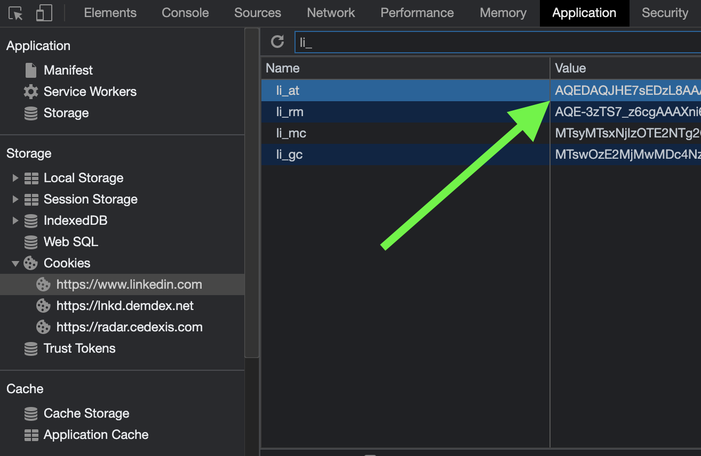

# Get your LinkedIn cookies manually

For Naas to perform tasks on your behalf within a social network, it needs to authenticate as you by using your session cookies. This grants Naas the necessary access to interact with your social network account securely.

Here’s how you can retrieve and set up your session cookies for Naas:

1. Navigate to your [LinkedIn profile](https://www.linkedin.com/in/).
2. Right-click on any part of the page and select “Inspect” to open the developer tools.

   

3. In the developer tools, click on the “Application” tab, then navigate to “Cookies” and select the specific website you're working with, like LinkedIn.

   

4. Look for the cookies named “li_at” and “JSESSIONID”. These are the session cookies Naas needs to access your account.

   
   

5. Finally, input these cookies into Naas to enable the connection to your social network account.

By following these steps, you equip Naas with the ability to seamlessly interact with your social network account, leveraging your digital presence for automated tasks and analytics.