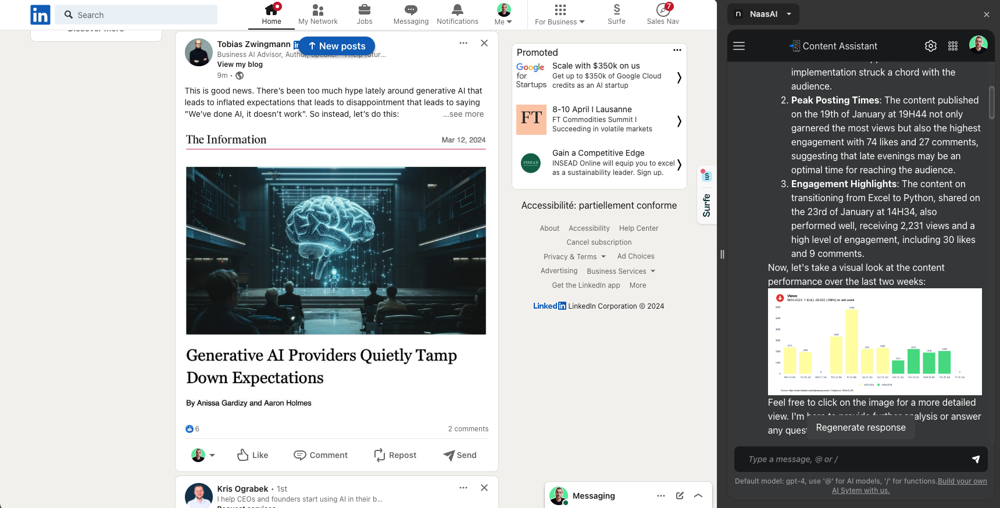
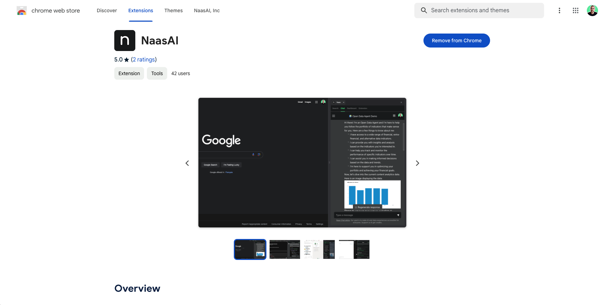

# Install Chrome Extension

The Naas Chrome Extension transforms your browsing experience by integrating the power of Naas directly into your Chrome browser. This guide will walk you through the simple steps to install the extension and explore its unique features.

## Key Features of the Naas Chrome Extension

- **Screen Splitting**: Automatically divides your Chrome browser screen, positioning your current webpage to the left and Naas on the right. This feature mirrors the convenience of a mobile app, allowing seamless multitasking and access to Naas functionalities alongside your web browsing.
  
- **Seamless LinkedIn Integration**: The extension enhances your LinkedIn experience by automatically capturing your LinkedIn cookies. This means you no longer need to manually update your cookies when you log out, streamlining your workflow on platforms requiring LinkedIn data.
  
- **Support for Multiple Accounts**: For users managing multiple profiles, Chrome profiles are recommended. Each profile operates independently, with its own set of extensions, ensuring that your Naas experience is tailored and uninterrupted across different accounts.

## Installation Guide

### Step 1: Locate the Extension
- Visit the [Chrome Web Store](https://chromewebstore.google.com/detail/naasai/cpkgfedlkfiknjpkmhcglmjiefnechpp).
- Search for the "Naas Chrome Extension."
     

### Step 2: Add the Extension
- Click on "Add to Chrome" next to the Naas Chrome Extension listing.
- Confirm the installation by selecting "Add Extension" in the pop-up window.

### Step 3: Access Naas on Your Browser
- Once installed, the Naas icon will appear in your browser's extension area.
- Click on the Naas icon to activate the extension. Your screen will split, with Naas appearing on the right side of your browser.

### Step 4: Enjoy Seamless Integration with LinkedIn
- Simply navigate to LinkedIn, and the Naas Chrome Extension will automatically handle cookie management for you.

### Step 5: Manage Multiple Accounts with Chrome Profiles
- If you use multiple LinkedIn accounts, set up separate Chrome profiles for each.
- Install the Naas Chrome Extension on each profile to maintain distinct sessions and extension settings.

## Conclusion

The Naas Chrome Extension is designed to enhance your productivity and streamline your online workflows. By bringing the full functionality of Naas into your browser and offering smart solutions like automatic LinkedIn cookie management, it ensures a more efficient and integrated browsing experience. For users with multiple accounts, leveraging Chrome profiles with separate extensions can provide a tailored experience for each use case.

Enjoy the enhanced capabilities of Naas, right within your Chrome browser, and take your productivity to new heights.