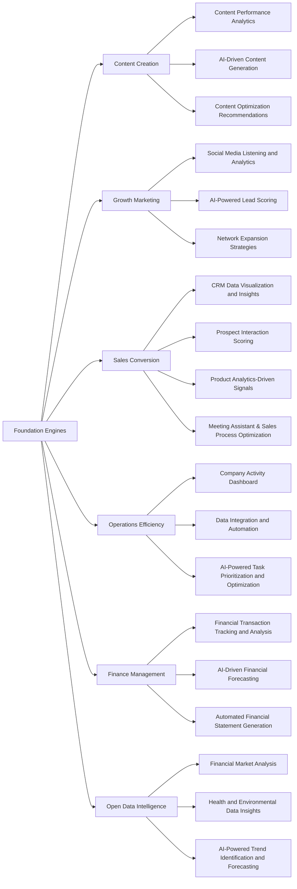

# Custom AI Assistant

> Accelerate your Data & AI Product Roadmap.

:::tip

We're in the early alpha stage, we recommend booking a meeting with us for personalized guidance and support.

:::

**Naas offers a range of data product solutions that cater to different business needs: we call them Foundation Engines and Plugins (or modules)**. These engines are core models that can be customized by companies to generate new opportunities and tailored solutions. From content optimization to finance management, these solutions leverage the power of data to drive growth, optimize operations, and facilitate informed decision-making. In this document, we will explore the various data product solutions provided by Naas and how they can be adapted to suit the unique requirements of your organization.

**Foundation Engines are pre-built data products that serve as a starting point for companies** **to build upon and tailor to their specific needs**. These engines offer powerful data-driven solutions across a range of business functions, including content, growth, sales, operations, finance, and open data. By using these engines as a foundation, organizations can customize and expand upon them to create unique data products that address their specific challenges and drive new opportunities for growth and innovation.

**Each Foundation Engine includes a set of Plugins that can be used independently or combined to create even more powerful and comprehensive data products**. These modules are designed to work seamlessly together, enabling organizations to build tailored solutions that leverage the full capabilities of the Naas platform. 

## Solutions

### Content Engine: Increase Reach and Boost Engagement 

1. Content Performance Analytics
    - Monitor content engagement metrics, such as views, likes, and shares, to identify high-performing content and optimize your content strategy.
2. AI-Driven Content Generation
    - Leverage large language models to generate relevant and engaging content, reducing the time and effort required to create compelling material.
3. Content Optimization Recommendations
    - Receive AI-driven recommendations to improve content quality, readability, and SEO, driving increased audience engagement and reach.

### Growth Engine: Get Qualified Contacts

1. Social Media Listening and Analytics
    - Monitor social media platforms for mentions, trends, and conversations relevant to your industry, helping you identify potential leads and influencers.
2. AI-Powered Lead Scoring
    - Utilize AI algorithms to score and prioritize leads, ensuring that your sales team focuses on the most promising opportunities.
3. Network Expansion Strategies
    - Receive AI-driven recommendations for expanding your network and increasing your total addressable market through targeted outreach and engagement.

### Sales Engine: Generate Deal Opportunities

1. CRM Data Visualization and Insights
    - Visualize and analyze your CRM data, providing a clear overview of your sales pipeline and deal progress.
2. Prospect Interaction Scoring
    - Track and score prospect interactions, allowing you to focus on highly engaged leads and optimize your sales efforts.
3. Product Analytics-Driven Signals
    - Leverage product usage data to identify customer needs and pain points, enabling your sales team to tailor their approach and close deals more effectively.
4. Meeting assistant & sales process optimization 
    - Transform your notes in actionable items to follow up with your prospect. Transform memos to close you deal and generate data on what works.

### Operations Engine: Create a Single Source of Truth and Automate Tedious Tasks

1. Company Activity Dashboard
    - Monitor and visualize key company activities, providing a centralized overview of your organization's performance.
2. Data Integration and Automation
    - Streamline and automate data workflows to eliminate manual tasks and ensure data consistency across your organization.
3. AI-Powered Task Prioritization and Optimization
    - Receive AI-driven recommendations for optimizing operations, helping your team focus on high-impact tasks and projects.

### Finance Engine: Visualize Financial Statements in Real-Time

1. Financial Transaction Tracking and Analysis
    - Monitor and analyze financial transactions, providing real-time visibility into your organization's financial health.
2. AI-Driven Financial Forecasting
    - Utilize AI algorithms to predict future financial performance, enabling proactive decision-making and resource allocation.
3. Automated Financial Statement Generation
    - Generate financial statements and reports with minimal manual intervention, streamlining financial reporting and analysis.

### Open Data Engine: Understand the World Around You

1. Financial Market Analysis
    - Aggregate and analyze open financial market data to identify trends, risks, and opportunities that impact your organization.
2. Health and Environmental Data Insights
    - Monitor and visualize health and environmental data, enabling your organization to understand the implications of global trends and events.
3. AI-Powered Trend Identification and Forecasting
    - Leverage AI algorithms to identify emerging trends and forecast their impact on your organization, allowing you to make data-driven strategic decisions.

## Core Model

Naas provides robust Foundation Engines and Plugins, which constitute the core model of our data product solutions. These models are designed to facilitate distinct business functions and can be tailored to address the unique needs and challenges of your organization. 

### Abstractions

The core model is based on six key abstraction items: Content, Interaction, Sequence, Task, Transaction, and Resource.

1. **Content**: At the heart of our core model is the creation and management of quality content. Our data product solutions enable organizations to generate, optimize, and disseminate content that effectively communicates their value proposition and engages their target audience.
2. **Interaction**: Our solutions also encompass growth marketing strategies to maximize audience interaction. Through strategic content distribution and audience engagement tactics, companies can enhance their visibility, attract and retain customers, and foster growth.
3. **Sequence**: We offer tools and methodologies to streamline the sales conversion process. Our Sequence abstraction allows organizations to guide potential customers through a structured sales funnel, from awareness to interest, decision, and finally, action.
4. **Task**: Operational efficiency is central to our core model. Our data product solutions provide companies with tools to manage their operational tasks effectively. This includes project management, task delegation, and tracking, all aimed at enhancing productivity and efficiency.
5. **Transaction**: Naas also provides solutions for effective financial management. With our Transaction abstraction, companies can manage their financial transactions efficiently, ensuring the financial health, profitability, and sustainability of their organization.
6. **Resource**: The final element of our core model is the leveraging of open data intelligence. Our Resource abstraction involves utilizing market research, competitor analysis, and customer behavior analysis to inform business strategies, drive innovation, and maintain a competitive edge.

The Foundation Engines and Plugins that Naas offers are designed to be used independently or combined for an even more powerful impact. They are also modular, allowing for seamless integration and the creation of comprehensive, tailor-made data products. By harnessing the power of these data-driven solutions, organizations can drive growth, optimize operations, and facilitate informed decision-making.

### Detailed Fields of the Core Model Following [Schema.org](http://schema.org/) Standards

In this section, we delve into the detailed fields of each part of our core model. Each part — Content, Interaction, Sequence, Task, Transaction, and Resource — is critical to the effective functioning of a business. To ensure maximum interoperability between different systems and platforms, we align these fields with [Schema.org](http://schema.org/) standards, which is a collaborative effort to create, maintain, and promote schemas for structured data on the Internet. Understanding the specific fields within each part of the core model will enable you to leverage these abstractions to their full potential in your data product solutions. Each field is meticulously detailed to provide a comprehensive understanding of its role, function, and importance within the broader core model.

Here is a set of key fields based on [Schema.org](http://schema.org/) standards for each part of the core model:

1. **Content**:
    - `CreativeWork`: This includes the entity responsible for the creation of the content, the date it was created, its relevance to the audience, genre, keywords, content location, content rating, the language of the content, the time required to consume the content, and associated media.
    - `MediaObject`: This involves the medium of the content (text, video, audio), its quality, the technology used to deliver it, encoding format, bitrate, content size, content URL, upload date, and duration.
    - `PublicationEvent`: This includes the channels used to disseminate the content, the geographic area it covers, the audience it reaches, publisher, publication date, and free or paid status.
2. **Interaction**:
    - `Audience`: This involves identifying and understanding the characteristics of the target audience, including their geographic location, socioeconomic status, age, gender, interests, and behaviors.
    - `InteractionCounter`: This includes metrics for measuring interactions such as views, likes, shares, comments, duration of interaction, and user rating.
    - `Action`: This encapsulates the strategies used to engage the audience, such as calls to action, interactive content, promotions, the time, and method of action, the object of the action, and the result.
3. **Sequence**:
    - `Offer`: This involves the products or services offered, their features, prices, availability, seller information, warranty, review, and rating.
    - `Order`: This includes information about the customer's order, including order number, order date, order status, ordered item, order delivery, order payment, and customer service contact.
    - `Invoice`: This relates to the payment request sent to the customer, including invoice number, billing period, payment due date, minimum payment due, and payment status.
4. **Task**:
    - `Action`: This involves the tasks to be completed, the agent responsible, the object the task is performed on, the status of the task, the expected completion date, and the result.
    - `EntryPoint`: This includes the application used to perform the task, the URL, supported data type, application category, and platform.
    - `SoftwareApplication`: This involves the software used to manage tasks, including the application category, name, operating system, software version, software features, and user rating.
5. **Transaction**:
    - `Invoice`: This includes the bill sent to the customer, including the invoice number, payment due date, account identifier, billing period, minimum payment due, payment status, and payment method.
    - `PaymentChargeSpecification`: This involves the details of the transaction, including the price, price currency, value added tax, and eligible transaction volume.
    - `MonetaryAmount`: This includes the monetary amount involved in the transaction, including the currency, value, and valid from and through dates.
6. **Resource**:
    - `DataFeedItem`: This includes the data items used to inform business strategies, including date created, date modified, and item.
    - `Dataset`: This involves the collection of data, including the dataset content, creator, distribution, included data catalog, and spatial and temporal coverage.
    - `Observation`: This relates to the analysis of the data, including the observed data type, observed data value, margin of error, and valid from and through dates.
    - 

While this core model provides a structured and comprehensive foundation, it's important to remember that every organization is unique, with its own set of challenges, opportunities, and objectives. Therefore, all the fields within each part of the core model can be customized and adapted to fit the specific needs and requirements of your organization. We encourage you to use this framework as a starting point and adapt it to create data product solutions that truly align with your business goals and operational realities. By tailoring the model to your organization's context, you can harness the full power of data to drive growth, optimize operations, and make informed, strategic decisions.

### Relationship between Core Model, Foundation Engines, and Plugins

The relationship between plugins, engines, and the core model can be understood in the context of their roles in a system:

- The **Core Model** is the fundamental structure that serves as the base for all operations. It encapsulates the main business abstractions and logic, providing the basis for the system's functionality. It's like the backbone of the system.
- **Foundation Engines** are built upon this Core Model. They provide pre-built data products that align with the abstractions of the Core Model, offering solutions for specific business functions like content, growth, sales, operations, finance, and open data. They leverage the Core Model to provide their services.
- **Plugins** are additional components that can be added to the Foundation Engines to enhance their functionality or provide new capabilities. They can either subscribe to the Core Model, meaning they adhere to and extend the system's existing abstractions, or they can provide additional functionality not covered by the Core Model. Plugins offer flexibility and customization, allowing organizations to tailor their data products to their specific needs.

In summary, the Core Model provides the basic structure, the Foundation Engines use this structure to deliver specific business solutions, and the Plugins offer the ability to enhance these solutions or add new capabilities. The relationship is a hierarchical one where the Core Model is at the base, Foundation Engines build upon it, and Plugins enhance the capabilities of the Foundation Engines.

### Core Model & Plugins Alignment

The notion of Plugins subscribing or not to the Core Model is a crucial aspect of Naas's data product solutions. This feature provides a high degree of customization and flexibility to organizations, allowing them to tailor the data solutions to their specific needs.

Plugins are modules or extensions that can be added to the Foundation Engines to enhance their functionality or provide additional capabilities. Each Plugin is designed to perform a specific function and can be used independently or in combination with other Plugins and Foundation Engines.

When we say a Plugin "subscribes" to the Core Model, it means that the Plugin aligns with and supports the functionalities provided by the core abstraction items (Content, Interaction, Sequence, Task, Transaction, Resource). These Plugins will seamlessly integrate with the Core Model to expand upon its functionalities, creating a comprehensive and powerful data product solution. For instance, a Plugin that subscribes to the "Interaction" abstraction might provide advanced analytics for measuring user engagement and interaction.

On the other hand, a Plugin that does not subscribe to the Core Model is one that provides functionalities outside the scope of the core abstraction items. These Plugins offer unique features that may not directly relate to the Core Model but can still add value to the overall data product solution. For example, a Plugin providing capabilities for real-time communication or chat functionality may not directly align with any of the core abstraction items, but it can still enhance the overall user experience and efficiency of the data solution.

Whether a Plugin subscribes to the Core Model or not, the key point is that it offers organizations the ability to customize their data product solutions. By selecting and combining different Plugins, companies can create tailored solutions that best meet their specific business needs and goals.

## Mindmap

### TLDR

Naas offers a wide range of data product solutions that address various business needs, empowering organizations to harness the power of data and drive growth. By leveraging these solutions, businesses can optimize their operations, improve decision-making, and maximize the value of their data assets.