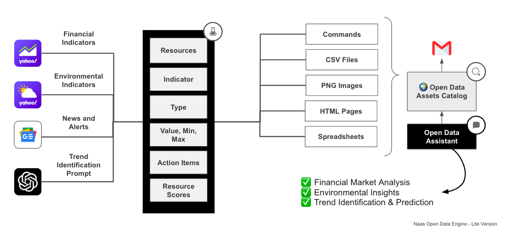

# Open Data Intelligence
---
Embrace the power of open data intelligence to gain a deeper understanding of the world around you.

:::tip

We're in the early alpha stage, this page is constantly evolving, book a call with us to learn more.

:::




Better Understand the World Around You.

This engine leverages publicly available data to provide insights and understanding about various facets of the world, ranging from financial markets to environmental patterns, societal trends, and beyond.

## Features

- Utilize AI algorithms to predict future financial performance, enabling proactive decision-making and resource allocation.
1. Financial Market Analysis
    - Aggregate and analyze open financial market data to identify trends, risks, and opportunities that impact your organization.
2. Health and Environmental Data Insights
    - Monitor and visualize health and environmental data, enabling your organization to understand the implications of global trends and events.
3. AI-Powered Trend Identification and Forecasting
    - Leverage AI algorithms to identify emerging trends and forecast their impact on your organization, allowing you to make data-driven strategic decisions.

## Financial Market Analysis

Aggregate and analyze open financial market data to identify trends, risks, and opportunities that impact your organization.

This module focuses on the aggregation and analysis of open financial market data. It identifies trends, risks, and opportunities that can significantly impact an organization's strategic and financial decisions.

### Dataset

The dataset for a Financial Market Analysis system might look something like this:

| DATE | STOCK TICKER | OPEN PRICE | HIGH PRICE | LOW PRICE | CLOSE PRICE | VOLUME |
| --- | --- | --- | --- | --- | --- | --- |
| 2023-05-24 | AAPL | 150.00 | 155.00 | 149.00 | 152.00 | 1000000 |
| 2023-05-24 | MSFT | 200.00 | 205.00 | 195.00 | 204.00 | 2000000 |
| 2023-05-24 | GOOGL | 2500.00 | 2520.00 | 2480.00 | 2510.00 | 500000 |
| 2023-05-24 | AMZN | 3300.00 | 3320.00 | 3270.00 | 3310.00 | 800000 |

### Schema

The data contract or schema for a Financial Market Analysis system might look something like this:

```
{
  "type": "object",
  "properties": {
    "DATE": {
      "type": "string",
      "format": "date",
      "description": "The date of the stock data."
    },
    "STOCK TICKER": {
      "type": "string",
      "description": "The stock ticker symbol."
    },
    "OPEN PRICE": {
      "type": "number",
      "description": "The opening price of the stock."
    },
    "HIGH PRICE": {
      "type": "number",
      "description": "The highest price of the stock during the trading day."
    },
    "LOW PRICE": {
      "type": "number",
      "description": "The lowest price of the stock during the trading day."
    },
    "CLOSE PRICE": {
      "type": "number",
      "description": "The closing price of the stock."
    },
    "VOLUME": {
      "type": "integer",
      "description": "The number of shares traded during the day."
    }
  },
  "required": ["DATE", "STOCK TICKER", "OPEN PRICE", "HIGH PRICE", "LOW PRICE", "CLOSE PRICE", "VOLUME"]
}

```

### Integrations

For integrations, a Financial Market Analysis system could potentially connect with:

1. **Financial Data Providers**: Services like Alpha Vantage, Yahoo Finance, or Google Finance provide APIs to access historical and real-time stock market data.
2. **Data Storage Systems**: To store the aggregated data for further analysis, integration with databases or data warehouses might be required.
3. **Data Analysis Tools**: Integration with data analysis platforms (like Tableau or Power BI) or data science tools (like Python or R) would be beneficial for analyzing the collected data.
4. **Machine Learning Platforms**: For more advanced analyses, integration with machine learning platforms might be useful for predicting future trends based on historical data.
5. **News and Social Media APIs**: Integrating with news and social media APIs can provide additional insights into market sentiment and potentially predict market movements.

## Health and Environmental Data Insights

Monitor and visualize health and environmental data, enabling your organization to understand the implications of global trends and events.

Leverage health and environmental data to comprehend the implications of global trends and events. With data-driven insights, your organization can make informed decisions and predictions based on a broad range of metrics.

### Dataset

Given a list of different health and environmental indicators, a typical dataset for a Health and Environmental Data Insights module might look like this:

| Indicator | Type of Indicator | Type of Metrics | Source | Value | Weight | Contribution | Extract date |
| --- | --- | --- | --- | --- | --- | --- | --- |
| Air quality | Environmental | Pollutant levels (ozone, particulate matter, carbon monoxide) | EPA | 100 | 2 | 200 | December 27, 2022 |
| Water quality | Environmental | pH, dissolved oxygen, nutrient levels | EPA, local water utilities | 90 | 1.5 | 135 | December 27, 2022 |
| Biodiversity | Environmental | Species richness, species abundance | WWF, CBD | 85 | 2 | 170 | December 27, 2022 |
| ... | ... | ... | ... | ... | ... | ... | ... |

### Schema

The data contract or schema for this dataset might look like this:

```
{
  "type": "object",
  "properties": {
    "Indicator": {
      "type": "string",
      "description": "The specific aspect of health or environment being measured."
    },
    "Type of Indicator": {
      "type": "string",
      "description": "The category that the indicator belongs to (Environmental, Economic, Social, etc.)."
    },
    "Type of Metrics": {
      "type": "string",
      "description": "The specific metrics used to measure the indicator."
    },
    "Source": {
      "type": "string",
      "description": "The source providing the data for the indicator."
    },
    "Value": {
      "type": "integer",
      "description": "The numerical value associated with the indicator."
    },
    "Weight": {
      "type": "number",
      "description": "The weight assigned to the indicator, affecting its overall contribution."
    },
    "Contribution": {
      "type": "integer",
      "description": "The total contribution of the indicator to the final index or score (calculated as Value * Weight)."
    },
    "Extract date": {
      "type": "string",
      "format": "date-time",
      "description": "The date when the data was extracted or updated."
    }
  },
  "required": ["Indicator", "Type of Indicator", "Type of Metrics", "Source", "Value", "Weight", "Contribution", "Extract date"]
}

```

### Integrations

A Health and Environmental Data Insights module could potentially integrate with:

1. **Health and Environmental Databases**: Such as databases from the EPA, CDC, NASA, and other organizations that provide health and environmental data.
2. **Economic and Social Data Sources**: Such as BEA, BLS, World Bank, and national statistical agencies for economic and social data.
3. **Data Visualization Tools**: To create effective visual representations of the data, integration with tools like Tableau, Power BI, or custom visualization libraries can be helpful.
4. **Data Storage Systems**: The system could connect to wherever you want the integrated data to be stored, like a company database or data warehouse.
5. **Alerting and Notification Systems**: To inform stakeholders of significant changes or trends in the data.

## AI-Powered Trend Identification and Forecasting

Leverage AI algorithms to identify emerging trends and forecast their impact on your organization, allowing you to make data-driven strategic decisions.

Harness AI algorithms to spot emerging trends and predict their potential effects on your organization, empowering you to make strategic decisions driven by data.

### Dataset

A typical dataset for an AI-Powered Trend Identification and Forecasting module might look like this:

| Trend | Type of Trend | Data Source | Time Frame | Trend Strength | Forecast Impact | Update Date |
| --- | --- | --- | --- | --- | --- | --- |
| Cryptocurrency Popularity | Financial | Google Trends, Social Media | Q4 2023 | 0.85 | High | December 27, 2023 |
| Remote Work Adoption | Socio-Economic | Job postings, Surveys | Q4 2023 | 0.75 | Medium | December 27, 2023 |
| Renewable Energy Use | Environmental | Energy reports, Government data | Q4 2023 | 0.90 | High | December 27, 2023 |
| ... | ... | ... | ... | ... | ... | ... |

### Schema

The data contract or schema for this dataset might look like this:

```
{
  "type": "object",
  "properties": {
    "Trend": {
      "type": "string",
      "description": "The specific trend being identified and tracked."
    },
    "Type of Trend": {
      "type": "string",
      "description": "The category that the trend belongs to (Financial, Socio-Economic, Environmental, etc.)."
    },
    "Data Source": {
      "type": "string",
      "description": "The source providing the data for the trend."
    },
    "Time Frame": {
      "type": "string",
      "description": "The time period during which the trend is observed."
    },
    "Trend Strength": {
      "type": "number",
      "description": "A numerical value representing the strength or intensity of the trend."
    },
    "Forecast Impact": {
      "type": "string",
      "description": "The estimated impact level of the trend on the organization or industry."
    },
    "Update Date": {
      "type": "string",
      "format": "date-time",
      "description": "The date when the trend data was last updated."
    }
  },
  "required": ["Trend", "Type of Trend", "Data Source", "Time Frame", "Trend Strength", "Forecast Impact", "Update Date"]
}

```

### Integrations

An AI-Powered Trend Identification and Forecasting module could potentially integrate with:

1. **Data Sources**: Such as social media platforms, Google Trends, news API, financial markets data, job postings, surveys, and other relevant sources that provide real-time data for trend identification.
2. **AI and Machine Learning Platforms**: Platforms like TensorFlow, PyTorch, or cloud AI platforms (e.g., Google AI, AWS AI, Azure AI) for building and running the trend prediction models.
3. **Data Visualization Tools**: For effectively visualizing the trends and their potential impacts, tools like Tableau, Power BI, or custom visualization libraries can be used.
4. **Data Storage Systems**: The system could connect to your preferred data storage location, such as a company database or data warehouse.
5. **Alerting and Notification Systems**: To inform stakeholders of significant trend changes or new emerging trends.