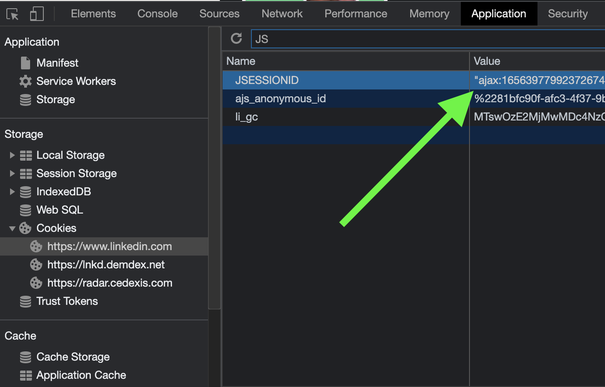

# How to get your LinkedIn cookies?

To take action on your behalf on a social network, Naas needs to connect as you. To do this, it needs your session cookie(s). This will give your Naas access to your social network account.

- [Open your profile](https://www.linkedin.com/in/)
- Right-click anywhere on the page and open "Inspect"

- Locate the "Application" tab. Then select "Cookies" > "[http://www.websiteyoureafter.com](http://www.websiteyoureafter.com/)". Locate the cookie you're looking for = "li_at" and "JSESSIONID" :

- Set up your cookies in Naas