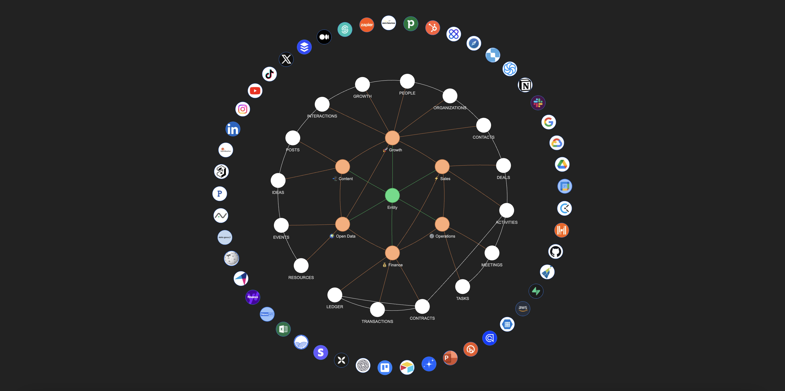

# Design Principles
---

## Mixture of Assistants
ABI is a sophisticated mixture of AI-driven business intelligence assistants, each designed to elevate and refine the efficiency of business operations. It is the primary product of the Naas Marketplace. This suite of assistants has been designed by our core team to cover business essentials with 6 assistants focused on content creation, growth marketing, sales conversion, operational efficiency, finance management and open data & market intelligence. Together, they form a cohesive system that enhances content performance, improves lead generation and qualification, streamlines operations and financial transactions, and utilizes external data for richer business insights. ABI's capabilities are further expanded through its integration with a variety of tools, APIs, both official and unofficial, enabling comprehensive data collection and enrichment.

## Standard Operating Procedures (SOPs)

Configurable to suit individual or organizational needs, each ABI Assistant champions its domain, governed by a meticulously defined SOP. These procedures dictate the foundational activities of the Assistants, offering a blueprint for data collection and process management. However, the true power of ABI lies in its adaptability; users are encouraged to tailor these SOPs to fit unique requirements, ensuring each Assistant's output aligns perfectly with specific operational goals.

### Expanding the Knowledge Base with OBTs and the ABI Knowledge Graph

Each Assistant specializes in its domain and contributes to an ever-expanding Knowledge Graph through the generation of OBTs (One Big Table). These OBTs encapsulate data in a structured format, serving as the knowledge base for each Assistant. This structured data collection method ensures that every piece of information is captured and categorized via a common ontology, ready to be leveraged for insights, predictions, and strategic decision-making.

As these SOPs are executed, Assistants perform their designated tasks and enrich the collective intelligence embodied by ABI's Knowledge Graph, making it a living, learning ecosystem, a unified knowledge framework that enables a deeper understanding and interconnected view of business operations. 

### Learn more about each ABI Assistant
- For [Content Creation](content-creation)
- For [Growth Marketing](growth-marketing)
- For [Sales Conversion](sales-conversion)
- For [Operations Efficiency](operations-efficiency) 
- For [Finance Management](finance-management)
- For [Open Data & Market Intelligence](opendata-intelligence)

## Customization
ABI’s architecture allows for extensive customization. Users can introduce new workflows or modify existing ones within the Naas ABI Repository without impacting the core models. This flexibility ensures your ABI system remains cutting-edge, automatically incorporating the latest updates while preserving your unique customizations.

ABI embodies the intersection of automation and intelligence, designed not just to perform tasks but to learn from them, continuously enhancing its capacity to drive business growth. Through its SOPs, OBTs, and the evolving Knowledge Graph, ABI offers a personalized, intelligent framework for tackling the complexities of modern business environments.

Learn more about ABI Customization on [Naas ABI Repository](../../../services/abi-repository)