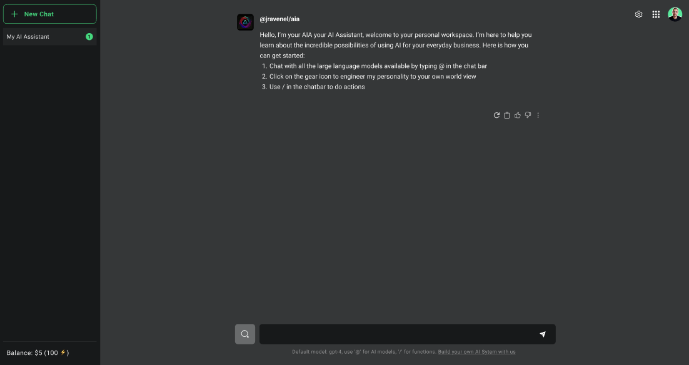
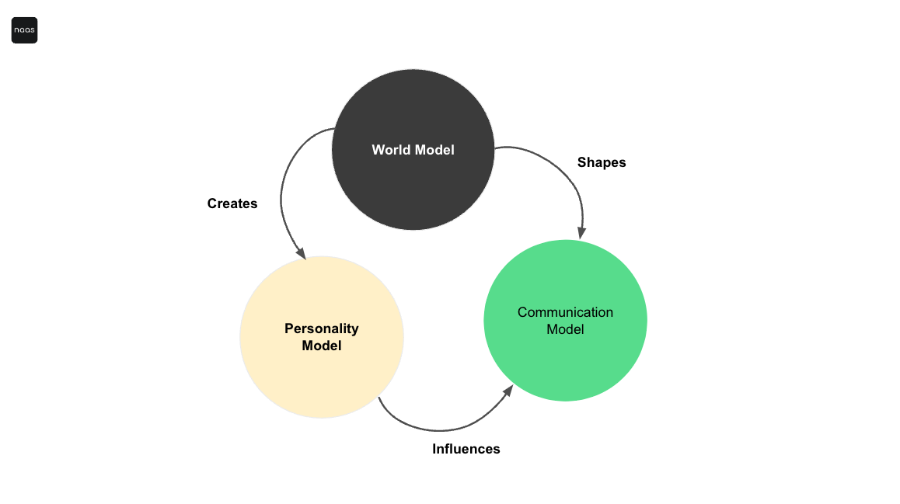

# AIA: Personal AI Assistant
---

## Overview
The Personal AI Assistant (AIA) enables you to tailor your AI alter-ego, responding more closely to your individual preferences and specific business requirements. By refining the prompt used to interact with the AIA and activating the memory feature (*Roadmap*), users can ensure that their assistant gains a deeper understanding of their world model, personality model, communication model, and business needs, leading to solutions and answers that are significantly more personalized and relevant.

## Custom Instructions
By providing custom instructions, you create a tailored system prompt that shapes the assistant's fundamental characteristics.

### World Model
Establish the assistant's knowledge foundation by outlining key facts about your business, industry, processes, and any other relevant domains. This part of the prompt ensures the assistant has the contextual understanding to provide insightful and relevant responses tailored to your specific setting.

### Personality Model
Define the assistant's core personality traits, values, areas of expertise, biographical details and more. This part of the prompt will influence how the assistant perceives the world and interacts with you. Craft a personality that suits your needs - professional, casual, humorous, or any custom combination.

### Communication Model
Customize how the assistant communicates by setting guidelines for tone, phrasing, formatting, personal quirks, idioms and communication style preferences. Make the interactions more formal, conversational, direct, nuanced or any tailored way you prefer.

By crafting detailed system prompt sections instructions for the world model, personality model and communication model, you create a truly personalized AI assistant tailored to your unique needs, knowledge domains, and desired interaction dynamics.

:::note
 For an AI that truly embodies your professional journey and continues to evolve with you, reach out to us. We offer on-demand personalization using your LinkedIn Profile to ensure your AI Assistant is a true extension of your professional self. Contact us at support@naas.ai
:::

## Connections to Tools, Actions, and Other Assistants
In addition to personalization, the AIA is engineered for seamless integration with an extensive selection of tools and platforms that are essential to users' daily operations. This capability extends beyond mere tool integration, allowing the AIA to also interact with and call upon other assistants within the ecosystem for a collaborative, multi-assistant approach. Such interoperability enables the AIA to not only execute specific actions and manage tasks within these tools but also to delegate tasks or gather insights from specialized assistants, enhancing workflow efficiency and effectiveness.

Whether orchestrating meetings, handling emails, generating reports from business intelligence tools, or collaborating with other AI-driven assistants for specialized tasks, the AIA offers a comprehensive solution. It can be finely tuned to perform a diverse range of actions, perfectly aligning with users' operational demands and preferences, thus ensuring a highly efficient and personalized working environment.
