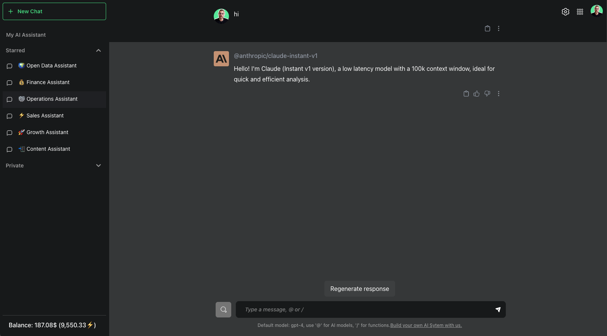
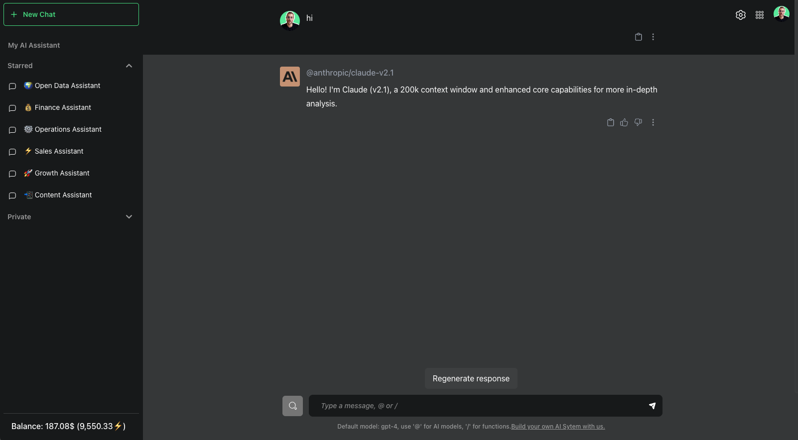
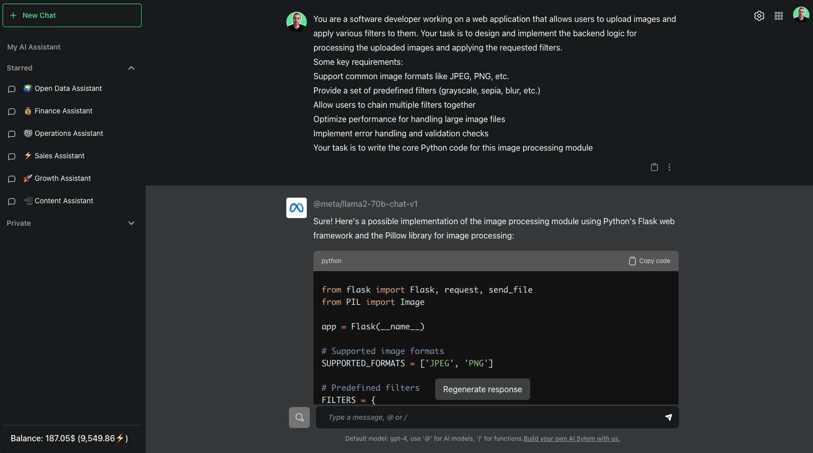
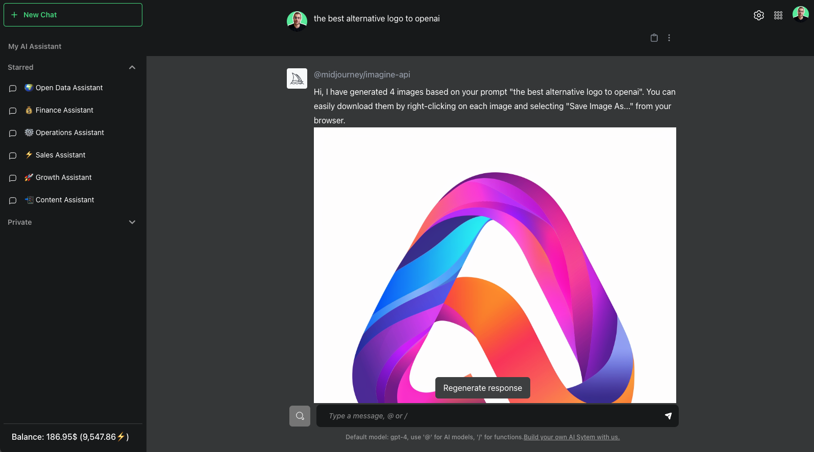
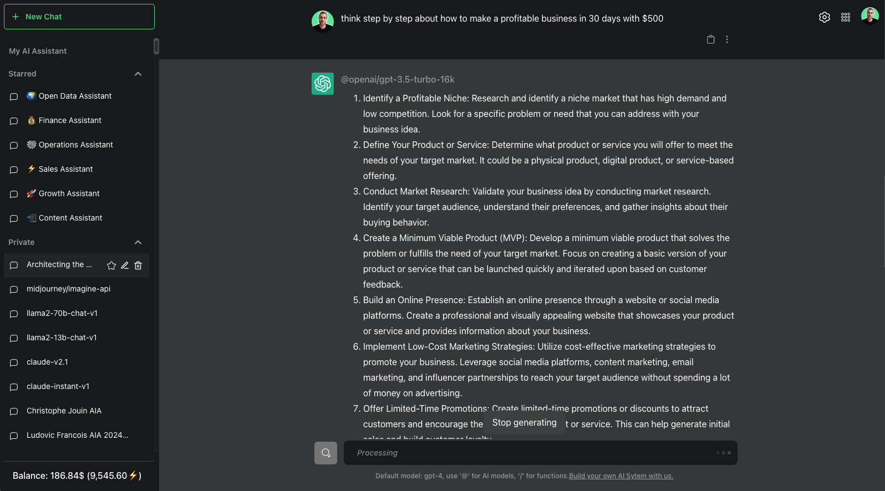
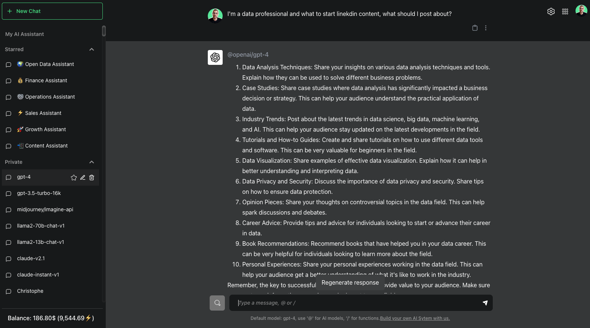
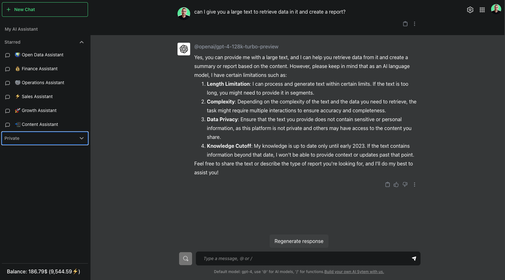
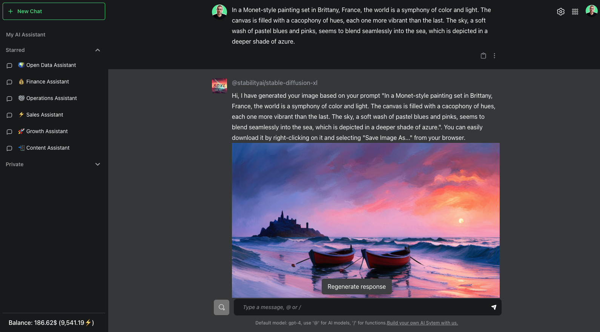

# Generative AI Models
---

## Overview
Our platform is continuously evolving, incorporating a dynamic range of foundation models to cater to diverse business intelligence and personal assistant needs. These models are selected for their robustness, efficiency, and capability to address specific tasks, ranging from textual analysis to creative content generation, and more.

## Available models 
We work with an evolving list of foundation models, ensuring that our platform remains at the cutting edge of AI technology. Some of the currently available models include:

### @claude-instant-v1 
**Claude Instant v1** by Anthropic is a cost-effective, low-latency language model with a 100,000 token context window. It excels at rapid analysis, quickly extracting insights and surfacing key information from large data sources. Optimized for efficient inference and minimal computational costs. Ideal for real-time, data-driven applications requiring extensive context awareness and fast processing speeds.

### @claude-v2:1
**Claude v2:1** by Anthropic boasts an expansive 200,000 token context window for comprehensive data analysis. With enhanced core language capabilities, it delivers more in-depth insights and nuanced understanding. Ideal for complex analysis of extensive datasets, documents, and knowledge repositories. Balances robust performance with computational efficiency. Empowers businesses with powerful, context-aware analysis at scale.

### @llama2-13b-chat-v1
**Llama2 13b v1** by Meta specializes in conversational AI and creative applications with a 4,000 token context window. Excels in natural language interactions, storytelling, and open-ended generation tasks. Leverages advanced language understanding for engaging and coherent dialog. Balances creativity with contextual awareness for diverse use cases. Ideal for chatbots, interactive fiction, and imaginative content creation.

### @llama2-70b-chat-v1
**Llama2 70b v1** by Meta excels in conversational AI, logical reasoning, and coding tasks with a 4,000 token context window. Combines advanced language understanding with analytical capabilities for engaging dialog and problem-solving. Adept at natural language processing and code generation. Offers contextual awareness and coherence across diverse domains. Versatile for interactive assistants, coding collaborators, and multi-turn reasoning.

### @midjourney-imagine-api
**Midjourney** is a powerful image generation API that transforms text prompts into visually stunning images. It combines state-of-the-art AI models with advanced diffusion techniques to bridge the gap between creativity and technology. Capable of generating highly detailed and imaginative imagery across diverse styles and subjects. Offers cutting-edge visual AI capabilities to create illustrations, logos, ads.

### @gpt-3.5-turbo-16k
**GPT 3.5 turbo 16k** by OpenAI offers exceptional performance on complex tasks with its 16,000 token context window. Excels at comprehending and reasoning over long-form content, extensive datasets, and multi-step problems. Renowned for its prowess in areas like analysis, research, creative writing, and coding. Provides contextual understanding and coherence across expansive inputs. Empowers users to tackle highly demanding AI workloads with unparalleled depth and capability.

### @gpt-4
**GPT 4** by OpenAI is a versatile and cost-effective model with a 4,000 token context window. Suitable for a wide range of applications spanning natural language processing, analysis, coding, and creative tasks. Offers a balanced blend of performance, efficiency, and affordability. Leverages advanced language understanding and generation capabilities. Empowers developers and businesses to integrate powerful AI solutions within reasonable computational constraints.

### @gpt-4-128k-turbo-preview
**GPT 4 128k turbo preview** by OpenAI features a 128,000 token context window model, equivalent to processing over 300 pages of text in a single prompt. Unmatched capacity for comprehensive analysis and generation across vast datasets and long-form content. Maintains coherence and relevance over extensive inputs with advanced language understanding. Ideal for AI research, deep domain exploration, and knowledge synthesis. Pushes boundaries of what's possible with large language models.

### @sdxl
**SDXL** by Stable Diffusion is an innovative model that generates descriptive images and embeds words within images from short text prompts. Enhances creative visual outputs by seamlessly blending language and imagery. Leverages advanced diffusion and synthesis techniques for highly detailed and imaginative results. Empowers artists, designers, and developers to explore new frontiers of AI-generated visuals

## Customizing system prompts, templating and fine-tuning
The platform allows for extensive customization of system prompts, enabling users to tailor the interaction and output of these foundation models to fit their specific needs. Through templating and fine-tuning, users can mold the AI's responses, ensuring that the output aligns with their unique requirements, whether for business intelligence, personal assistance, or creative projects. This level of customization ensures that each model can be effectively adapted to serve a broad spectrum of tasks, from data analysis and report generation to creative writing and image creation.

Explore the search with 2000+ community templates: https://naas.ai/search?t=prompts 